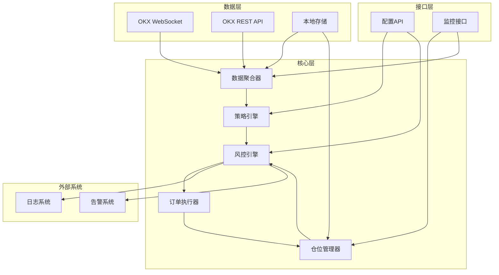
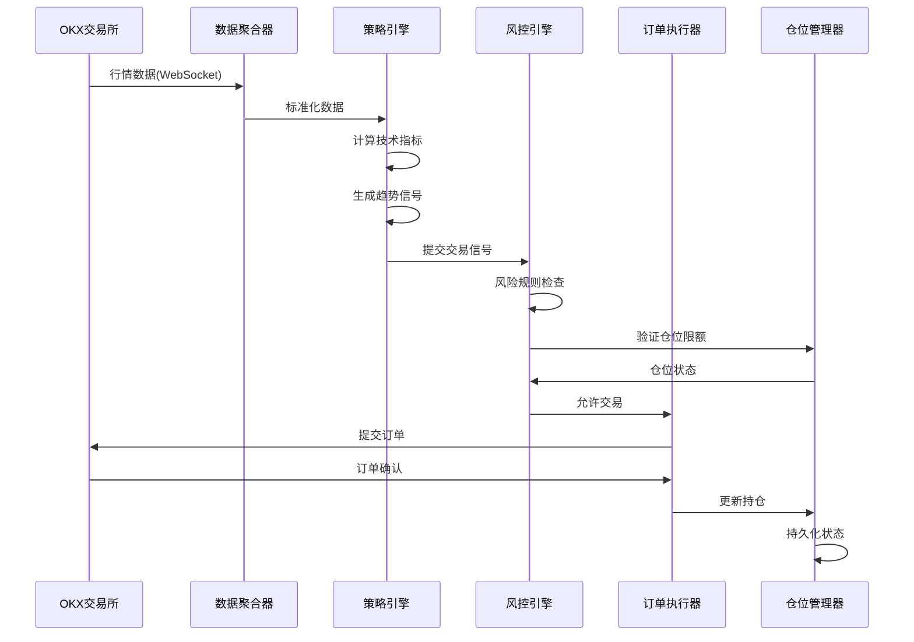
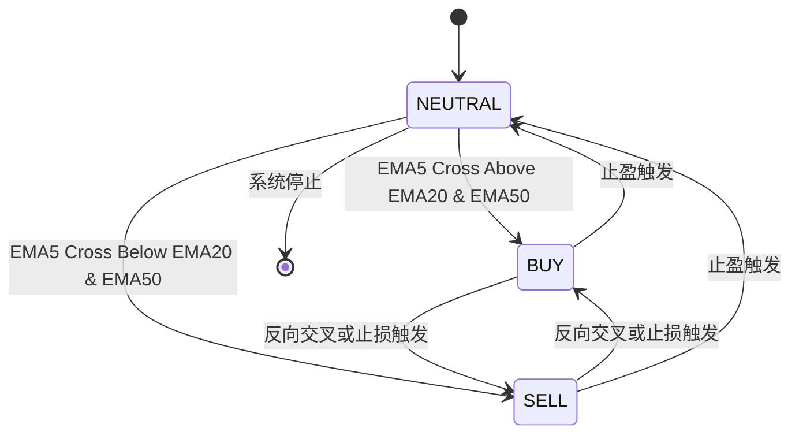
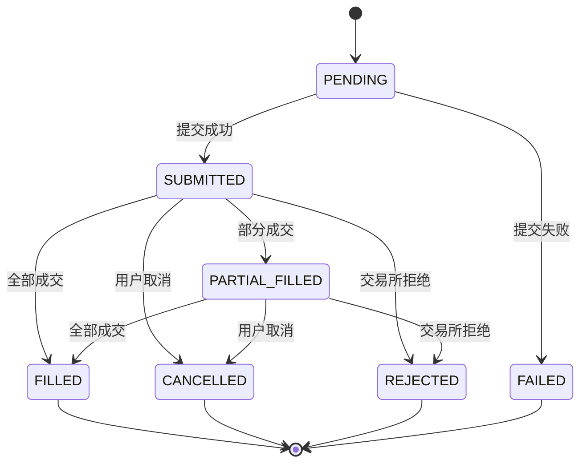
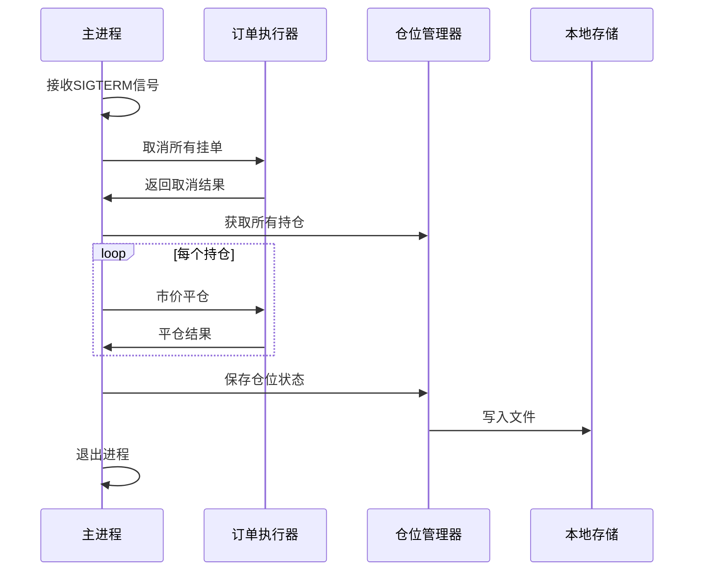

# 加密货币量化交易系统技术设计

## 描述

CRYPTO-TREND 是一款专注于OKX交易所的加密货币趋势跟踪量化交易系统。系统采用事件驱动架构，实现从市场数据采集、策略信号生成、订单执行到风险管理的全流程自动化。核心设计目标包括：毫秒级延迟性能、多层次风险控制、模块化可扩展架构。

## 架构

### 整体架构图



### 核心流程



## 组件和接口

### 1. 数据聚合器 (Data Aggregator)

**职责**：负责从OKX WebSocket和REST API采集市场数据，并进行标准化处理。

**接口定义**：

| 方法 | 说明 | 输入 | 输出 |
|------|------|------|------|
| `connect()` | 建立WebSocket连接 | 无 | ConnectionResult |
| `subscribe(symbols)` | 订阅交易对行情 | 交易对列表 | SubscribeResult |
| `get_klines(symbol, interval, limit)` | 获取K线数据 | 交易对, 周期, 数量 | KLine[] |
| `disconnect()` | 断开连接 | 无 | void |

**数据结构**：

```python
class KLine:
    timestamp: int      # UTC时间戳(毫秒)
    open: float          # 开盘价
    high: float          # 最高价
    low: float           # 最低价
    close: float         # 收盘价
    volume: float         # 成交量
    
class Ticker:
    symbol: str          # 交易对
    last_price: float    # 最新价
    bid_price: float     # 买一价
    ask_price: float     # 卖一价
    volume: float        # 24h成交量
    timestamp: int       # 时间戳
```

### 2. 策略引擎 (Strategy Engine)

**职责**：执行趋势跟踪策略逻辑，计算技术指标并生成交易信号。

**接口定义**：

| 方法 | 说明 | 输入 | 输出 |
|------|------|------|------|
| `calculate_indicators(klines)` | 计算技术指标 | K线数据 | IndicatorSet |
| `generate_signal(indicators)` | 生成交易信号 | 指标集 | TrendSignal |
| `set_parameters(params)` | 设置策略参数 | 参数映射 | void |

**指标计算规格**：

| 指标 | 周期 | 计算公式 |
|------|------|----------|
| EMA5 | 5 | 指数移动平均线 |
| EMA20 | 20 | 指数移动平均线 |
| EMA50 | 50 | 指数移动平均线 |
| RSI | 14 | 100 - 100/(1+RS) |
| ATR | 14 | Avg(TrueRange) |

**信号定义**：

```python
class TrendSignal:
    direction: SignalDirection  # BUY, SELL, NEUTRAL
    entry_price: float         # 入场价格
    stop_loss: float           # 止损价格
    take_profit: float         # 止盈价格
    confidence: float          # 置信度 [0, 1]
    indicators: IndicatorSet   # 当时指标值
    timestamp: int             # 信号生成时间
    
class IndicatorSet:
    ema5: float
    ema20: float
    ema50: float
    rsi: float
    atr: float
    trend_strength: float      # 趋势强度 [0, 1]
```

### 3. 风控引擎 (Risk Engine)

**职责**：实时监控交易活动的风险指标，执行风控规则。

**接口定义**：

| 方法 | 说明 | 输入 | 输出 |
|------|------|------|------|
| `check_order(signal, position)` | 检查订单风险 | 信号, 持仓 | CheckResult |
| `check_portfolio(positions)` | 检查组合风险 | 持仓列表 | PortfolioRisk |
| `get_limits()` | 获取风控限额 | 无 | RiskLimits |
| `update_limits(limits)` | 更新风控限额 | 限额参数 | void |

**风控规则表**：

| 规则 | 阈值 | 动作 |
|------|------|------|
| 单笔金额上限 | 账户余额10% | 拒绝订单 |
| 持仓上限 | 账户余额20% | 拒绝开仓 |
| 日交易额上限 | 账户余额200% | 暂停交易 |
| 亏损止损线 | 浮动亏损10% | 自动平仓 |
| 预警线 | 浮动亏损5% | 发送预警 |

### 4. 订单执行器 (Order Executor)

**职责**：将交易信号转化为实际订单，与OKX API交互。

**接口定义**：

| 方法 | 说明 | 输入 | 输出 |
|------|------|------|------|
| `submit_order(order)` | 提交订单 | OrderRequest | OrderResponse |
| `cancel_order(order_id)` | 取消订单 | 订单ID | CancelResult |
| `get_order_status(order_id)` | 查询订单状态 | 订单ID | OrderStatus |
| `get_balance()` | 获取账户余额 | 无 | Balance |

**订单请求**：

```python
class OrderRequest:
    symbol: str          # 交易对，如 "BTC-USDT"
    side: OrderSide      # BUY 或 SELL
    order_type: OrderType  # MARKET 或 LIMIT
    price: float         # 价格(LIMIT单)
    quantity: float      # 数量
    client_order_id: str # 客户端订单ID
    
class OrderResponse:
    order_id: str        # 交易所订单ID
    client_order_id: str # 客户端订单ID
    status: OrderStatus  # 订单状态
    filled_qty: float    # 已成交数量
    avg_price: float     # 成交均价
    timestamp: int       # 时间戳
```

### 5. 仓位管理器 (Position Manager)

**职责**：管理当前持仓状态，跟踪盈亏，持久化仓位数据。

**接口定义**：

| 方法 | 说明 | 输入 | 输出 |
|------|------|------|------|
| `open_position(position)` | 开仓 | Position | Result |
| `close_position(symbol)` | 平仓 | 交易对 | Result |
| `update_position(position)` | 更新持仓 | Position | void |
| `get_positions()` | 获取所有持仓 | 无 | Position[] |
| `get_position(symbol)` | 获取指定持仓 | 交易对 | Position |
| `calculate_pnl()` | 计算盈亏 | 无 | PnLReport |

**持仓数据结构**：

```python
class Position:
    symbol: str          # 交易对
    side: PositionSide   # LONG 或 SHORT
    quantity: float      # 持仓数量
    entry_price: float  # 开仓均价
    current_price: float # 当前价格
    unrealized_pnl: float # 浮动盈亏
    margin: float        # 占用保证金
    timestamp: int       # 开仓时间
```

## 数据模型

### 交易信号状态机



### 订单状态流转



## 正确性属性

### 系统不变式

1. **余额不变性**：任何时刻，账户余额变化量等于已实现盈亏减去手续费
2. **持仓一致性**：持仓数量等于所有成交订单的累计买入减去累计卖出
3. **订单唯一性**：同一client_order_id的订单不会被重复提交
4. **风控前置性**：任何订单在提交前必须通过风控引擎检查

### 并发约束

1. **仓位操作原子性**：仓位的更新操作必须具有原子性
2. **订单并发控制**：同一交易对的订单串行处理
3. **数据线程安全**：行情数据采用读写锁保护

## 错误处理

### 错误分类与策略

| 错误类型 | 错误码 | 处理策略 |
|----------|--------|----------|
| 网络超时 | ETIMEDOUT | 重试3次，间隔1s/2s/4s |
| 限流 | 429 | 退避60秒，记录日志 |
| 认证失败 | 401/403 | 立即停止，告警 |
| 余额不足 | 20001 | 拒绝订单，告警 |
| 持仓超限 | 20002 | 拒绝开仓 |
| 订单被拒 | 其他5xxxx | 记录详情，跳过 |

### 优雅关闭流程



## 测试策略

### 单元测试

- 策略引擎指标计算正确性验证
- 风控引擎规则执行验证
- 仓位计算精度验证

### 集成测试

- WebSocket连接与重连机制验证
- 订单提交流程端到端验证
- 风控规则实际执行验证

### 模拟交易测试

- 使用历史数据回测策略表现
- 验证模拟订单成交机制
- 绩效指标计算准确性验证

### 性能测试

- 数据处理延迟测量（目标<1ms）
- 策略计算延迟测量（目标<5ms）
- 端到端延迟测量（目标<20ms）

## 项目结构

```
crypto-trend-trading/
├── src/
│   ├── main.py                 # 程序入口
│   ├── config/
│   │   └── config.yaml         # 配置文件
│   ├── core/
│   │   ├── __init__.py
│   │   ├── data_aggregator.py  # 数据聚合器
│   │   ├── strategy_engine.py # 策略引擎
│   │   ├── risk_engine.py      # 风控引擎
│   │   ├── order_executor.py   # 订单执行器
│   │   └── position_manager.py # 仓位管理器
│   ├── utils/
│   │   ├── __init__.py
│   │   ├── logger.py           # 日志工具
│   │   ├── indicator.py        # 技术指标计算
│   │   └── okx_client.py       # OKX API客户端
│   └── tests/
│       ├── test_strategy.py
│       ├── test_risk.py
│       └── test_order.py
├── requirements.txt
└── README.md
```

## 配置项

### 配置文件格式 (config.yaml)

```yaml
exchange:
  api_key: ${OKX_API_KEY}      # 通过环境变量注入
  secret_key: ${OKX_SECRET_KEY} # 通过环境变量注入
  passphrase: ${OKX_PASSPHRASE} # 通过环境变量注入
  testnet: false                # 是否使用测试网

symbols:
  - BTC-USDT
  - ETH-USDT
  - SOL-USDT

strategy:
  indicators:
    ema_periods: [5, 20, 50]
    rsi_period: 14
    atr_period: 14
  signal:
    min_confidence: 0.6        # 最小置信度
    ema_convergence_threshold: 0.001  # EMA收敛阈值

risk:
  order:
    max_single_order_ratio: 0.1      # 单笔金额上限 10%
    max_position_ratio: 0.2         # 持仓上限 20%
    max_daily_trade_ratio: 2.0       # 日交易额上限 200%
  stop_loss:
    warning_ratio: 0.05              # 预警线 5%
    auto_stop_ratio: 0.10            # 自动止损 10%

execution:
  slippage: 0.0005                   # 滑点补偿 0.05%
  timeout: 10                        # 订单超时(秒)
  
monitoring:
  log_level: INFO
  metrics_interval: 1               # 指标采集间隔(秒)
```

## 性能指标

| 指标 | 目标值 | 说明 |
|------|--------|------|
| 数据处理延迟 | <1ms | 单条行情数据处理 |
| 策略计算延迟 | <5ms | 趋势信号生成 |
| 订单提交延迟 | <10ms | 订单提交到确认 |
| 端到端延迟 | <20ms | 行情到订单总延迟 |
| 系统可用性 | 99.9% | 月停机<45分钟 |
| 并发交易对 | 100+ | 同时处理能力 |
