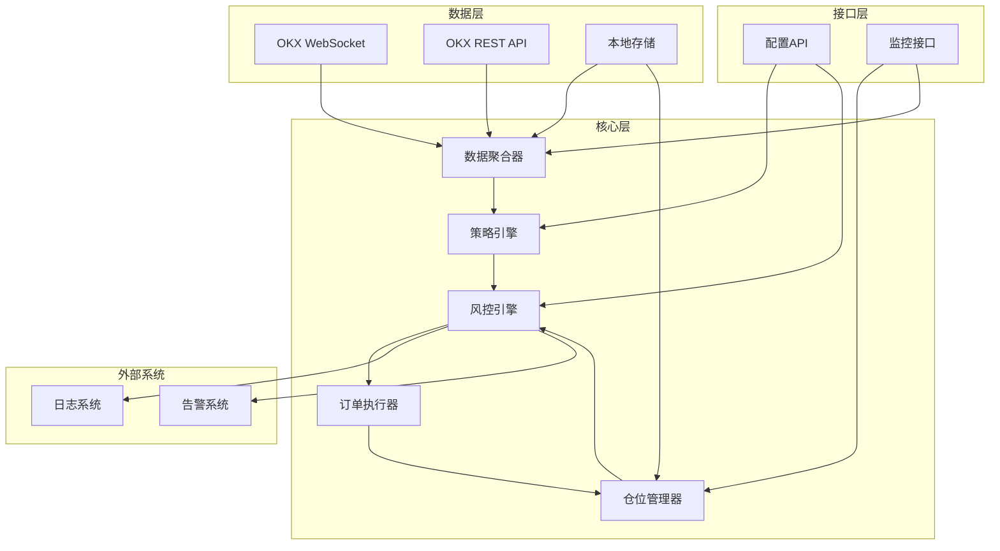
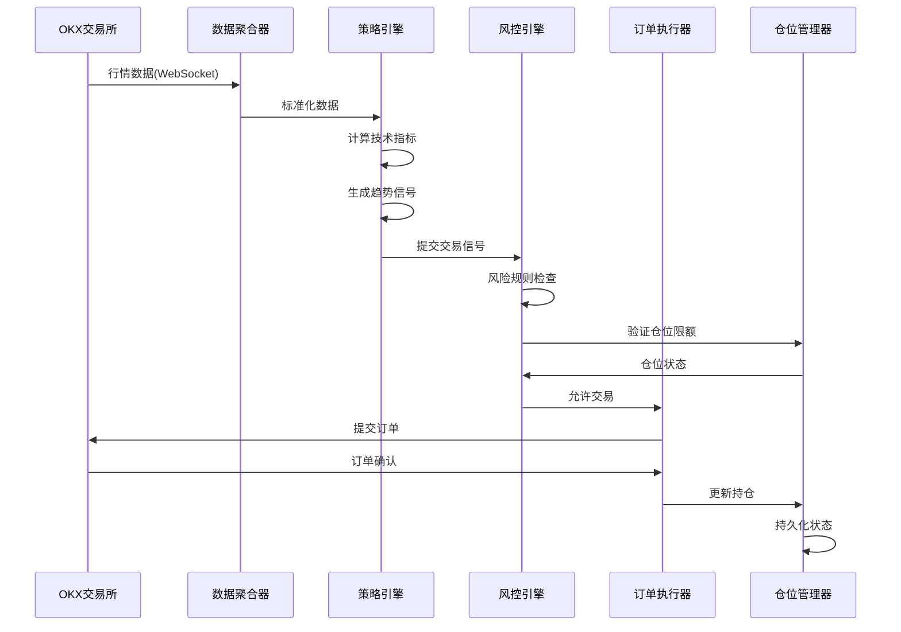
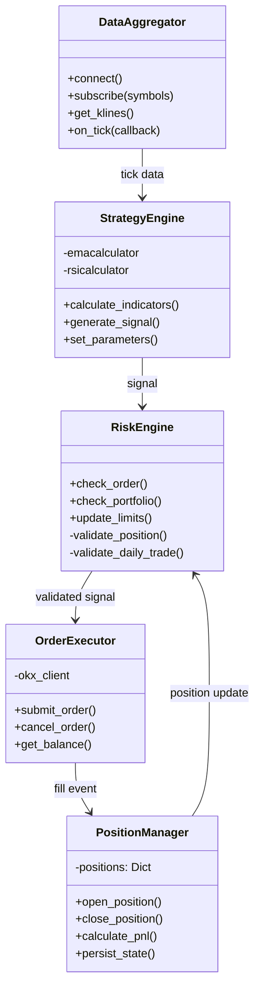
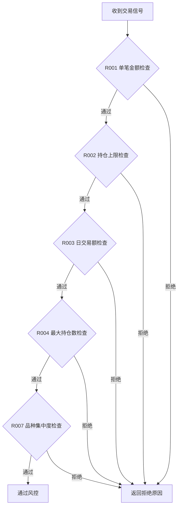
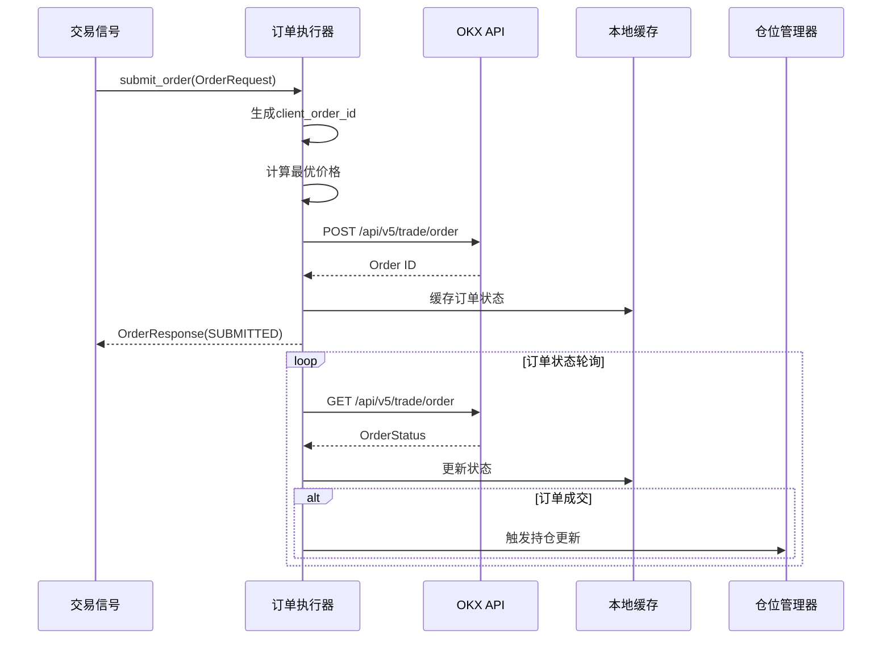
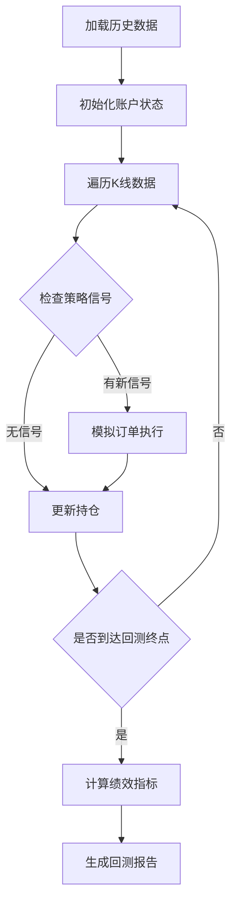

# 加密货币量化交易系统技术设计

## 描述

CRYPTO-TREND 是一款专注于OKX交易所的加密货币趋势跟踪量化交易系统。系统采用事件驱动架构，实现从市场数据采集、策略信号生成、订单执行到风险管理的全流程自动化。核心设计目标包括：毫秒级延迟性能、多层次风险控制、模块化可扩展架构。

## 词汇表

| 术语 | 定义 |
|------|------|
| WebSocket | 双向实时通信协议，用于接收市场数据流 |
| REST API | 传统HTTP请求接口，用于查询历史数据和提交订单 |
| K线 | 也称蜡烛图，记录特定时间周期的开盘价、最高价、最低价、收盘价 |
| EMA | 指数移动平均线，对近期价格赋予更高权重的移动平均线 |
| RSI | 相对强弱指数，衡量价格变动速度的动量指标 |
| ATR | 平均真实波幅，衡量市场波动性的指标 |
| 滑点 | 预期成交价与实际成交价之间的偏差 |
| 仓位 | 交易者持有的某种资产的数量 |
| 保证金 | 开仓时需要冻结的资金 |
| 浮动盈亏 | 当前持仓按市价计算的理论盈亏 |
| 置信度 | 策略信号的可信程度，范围0到1 |
| 回测 | 使用历史数据模拟交易策略进行验证 |
| 优雅关闭 | 系统收到停止信号后执行的安全关闭流程 |
| 标记价格 | 交易所用于计算浮动盈亏和强制平仓的价格 |
| 强平价格 | 仓位触发强制平仓的价格阈值 |
| 夏普比率 | 衡量策略风险调整后收益的指标 |
| 索提诺比率 | 衡量下行风险调整后收益的指标，区别对待波动方向 |
| 最大回撤 | 策略历史最高点到最低点的最大跌幅 |
| 盈亏比 | 平均盈利金额与平均亏损金额的比值 |
| 胜率 | 盈利交易次数占总交易次数的比例 |

## 架构

| 术语 | 定义 |
|------|------|
| WebSocket | 双向实时通信协议，用于接收市场数据流 |
| REST API | 传统HTTP请求接口，用于查询历史数据和提交订单 |
| K线 | 也称蜡烛图，记录特定时间周期的开盘价、最高价、最低价、收盘价 |
| EMA | 指数移动平均线，对近期价格赋予更高权重的移动平均线 |
| RSI | 相对强弱指数，衡量价格变动速度的动量指标 |
| ATR | 平均真实波幅，衡量市场波动性的指标 |
| 滑点 | 预期成交价与实际成交价之间的偏差 |
| 仓位 | 交易者持有的某种资产的数量 |
| 保证金 | 开仓时需要冻结的资金 |
| 浮动盈亏 | 当前持仓按市价计算的理论盈亏 |

## 架构

### 整体架构图



### 核心流程



### 部署架构

```mermaid
graph TB
    subgraph 交易网络["交易网络 (隔离)")
        Trader["量化交易节点"]
        Trader --> FW["硬件防火墙"]
    end
    
    subgraph 交易所连接["交易所连接"]
        FW --> LB["负载均衡器"]
        LB --> OKX["OKX交易所"]
    end
    
    subgraph 监控网络["监控网络"]
        Monitor["监控告警服务"]
        Logger["日志收集服务"]
    end
    
    Trader --> Monitor
    Trader --> Logger
```

### 系统组件关系



## 组件和接口

### 1. 数据聚合器 (Data Aggregator)

**职责**：负责从OKX WebSocket和REST API采集市场数据，并进行标准化处理。

**接口定义**：

| 方法 | 说明 | 输入 | 输出 |
|------|------|------|------|
| `connect()` | 建立WebSocket连接 | 无 | ConnectionResult |
| `subscribe(symbols)` | 订阅交易对行情 | 交易对列表 | SubscribeResult |
| `get_klines(symbol, interval, limit)` | 获取K线数据 | 交易对, 周期, 数量 | KLine[] |
| `disconnect()` | 断开连接 | 无 | void |
| `get_ticker(symbol)` | 获取最新行情 | 交易对 | Ticker |

**数据结构**：

```python
@dataclass
class KLine:
    timestamp: int      # UTC时间戳(毫秒)
    open: float         # 开盘价
    high: float         # 最高价
    low: float          # 最低价
    close: float        # 收盘价
    volume: float      # 成交量
    quote_volume: float # 成交额(USDТ)
    
@dataclass
class Ticker:
    symbol: str         # 交易对 "BTC-USDT"
    last_price: float   # 最新价
    bid_price: float   # 买一价
    bid_qty: float     # 买一量
    ask_price: float   # 卖一价
    ask_qty: float     # 卖一量
    high_24h: float     # 24h最高价
    low_24h: float      # 24h最低价
    volume_24h: float   # 24h成交量
    timestamp: int      # 时间戳
```

**OKX WebSocket订阅格式**：

```python
# 订阅行情频道
SUBSCRIBE_MESSAGE = {
    "op": "subscribe",
    "args": [
        {
            "channel": "tickers",
            "instId": "BTC-USDT"
        },
        {
            "channel": "candle1m",
            "instId": "BTC-USDT"
        }
    ]
}
```

**OKX REST API端点**：

| 用途 | 方法 | 端点 | 频率限制 |
|------|------|------|----------|
| 获取K线 | GET | /api/v5/market/candles | 20次/2s |
| 获取行情 | GET | /api/v5/market/ticker | 20次/2s |
| 获取订单簿 | GET | /api/v5/market/books | 20次/2s |
| 下单 | POST | /api/v5/trade/order | 60次/2s |
| 取消订单 | POST | /api/v5/trade/cancel-order | 60次/2s |
| 查订单 | GET | /api/v5/trade/order | 60次/2s |
| 查持仓 | GET | /api/v5/account/positions | 60次/2s |
| 查余额 | GET | /api/v5/account/balance | 60次/2s |

### 2. 策略引擎 (Strategy Engine)

**职责**：执行趋势跟踪策略逻辑，计算技术指标并生成交易信号。

**接口定义**：

| 方法 | 说明 | 输入 | 输出 |
|------|------|------|------|
| `calculate_indicators(klines)` | 计算技术指标 | K线数据 | IndicatorSet |
| `generate_signal(indicators)` | 生成交易信号 | 指标集 | TrendSignal |
| `set_parameters(params)` | 设置策略参数 | 参数映射 | void |
| `backtest(data, config)` | 执行回测 | 历史数据, 配置 | BacktestResult |

**指标计算规格**：

| 指标 | 周期 | 计算公式 | 说明 |
|------|------|----------|------|
| EMA5 | 5 | `EMA_t = price_t * k + EMA_{t-1} * (1-k)`, k=2/(5+1) | 短期趋势 |
| EMA20 | 20 | `k=2/(20+1)` | 中期趋势 |
| EMA50 | 50 | `k=2/(50+1)` | 长期趋势 |
| RSI | 14 | `100 - 100/(1+RS)`, RS=AvgGain/AvgLoss | 超买超卖 |
| ATR | 14 | `Avg(TrueRange)`, TR=max(H-L, H-PC, PC-L) | 波动率 |
| MACD | 12/26/9 | `EMA12 - EMA26`, Signal=EMA9(MACD) | 趋势动量 |

**信号定义**：

```python
from enum import Enum
from dataclasses import dataclass
from typing import Optional

class SignalDirection(Enum):
    BUY = "buy"
    SELL = "sell"
    NEUTRAL = "neutral"
    
@dataclass
class TrendSignal:
    id: str                    # 信号唯一ID (UUID)
    symbol: str                 # 交易对
    direction: SignalDirection  # 交易方向
    entry_price: float         # 建议入场价格
    stop_loss: float           # 止损价格
    take_profit: float         # 止盈价格
    confidence: float          # 置信度 [0.0, 1.0]
    indicators: IndicatorSet   # 当时指标值
    reason: str                # 信号生成原因
    timestamp: int              # 信号生成时间(ms)
    expires_at: int            # 信号过期时间(ms)
    
@dataclass
class IndicatorSet:
    ema5: float
    ema20: float
    ema50: float
    ema_convergence: float     # EMA收敛度 (-1到1, 正值看涨)
    rsi: float                 # 0-100
    atr: float
    macd: float
    macd_signal: float
    macd_histogram: float
    trend_strength: float      # 趋势强度 [0.0, 1.0]
```

**信号生成规则**：

```python
def generate_signal(indicators: IndicatorSet) -> TrendSignal:
    # 买入条件
    if (indicators.ema5 > indicators.ema20 > indicators.ema50 and
        indicators.ema_convergence > 0.01 and
        indicators.rsi < 70 and
        indicators.confidence >= config.min_confidence):
        return TrendSignal(direction=SignalDirection.BUY, ...)
    
    # 卖出条件
    if (indicators.ema5 < indicators.ema20 < indicators.ema50 and
        indicators.ema_convergence < -0.01 and
        indicators.rsi > 30 and
        indicators.confidence >= config.min_confidence):
        return TrendSignal(direction=SignalDirection.SELL, ...)
    
    return TrendSignal(direction=SignalDirection.NEUTRAL, ...)
```

**止损止盈计算**：

```python
def calculate_stop_loss_take_profit(
    entry_price: float,
    atr: float,
    direction: SignalDirection
) -> tuple[float, float]:
    atr_multiplier = 2.0  # 2倍ATR作为止损
    atr_tp_multiplier = 3.0  # 3倍ATR作为止盈
    
    if direction == SignalDirection.BUY:
        stop_loss = entry_price - atr * atr_multiplier
        take_profit = entry_price + atr * atr_tp_multiplier
    else:
        stop_loss = entry_price + atr * atr_multiplier
        take_profit = entry_price - atr * atr_tp_multiplier
        
    return stop_loss, take_profit
```

### 3. 风控引擎 (Risk Engine)

**职责**：实时监控交易活动的风险指标，执行风控规则。

**接口定义**：

| 方法 | 说明 | 输入 | 输出 |
|------|------|------|------|
| `check_order(signal, balance)` | 检查订单风险 | 信号, 余额 | CheckResult |
| `check_portfolio(positions)` | 检查组合风险 | 持仓列表 | PortfolioRisk |
| `get_limits()` | 获取风控限额 | 无 | RiskLimits |
| `update_limits(limits)` | 更新风控限额 | 限额参数 | void |
| `trigger_stop_loss(position)` | 触发止损 | 持仓 | StopLossResult |

**风控规则表**：

| 规则ID | 规则名称 | 阈值计算 | 触发动作 | 优先级 |
|--------|----------|----------|----------|--------|
| R001 | 单笔金额上限 | 余额 × max_single_order_ratio | 拒绝订单 | 1 |
| R002 | 持仓上限 | 余额 × max_position_ratio | 拒绝开仓 | 1 |
| R003 | 日交易额上限 | 余额 × max_daily_trade_ratio | 暂停交易 | 1 |
| R004 | 最大持仓数 | max_positions | 拒绝新开仓 | 2 |
| R005 | 亏损预警线 | 浮动亏损 ≥ 余额 × warning_ratio | 发送预警 | 3 |
| R006 | 自动止损线 | 浮动亏损 ≥ 余额 × auto_stop_ratio | 自动平仓 | 3 |
| R007 | 品种集中度 | 单品种价值 ≤ 余额 × max_concentration | 拒绝开仓 | 2 |

**风控检查流程**：



**风控结果**：

```python
@dataclass
class CheckResult:
    passed: bool
    rejected_by: Optional[str]  # 规则ID
    rejected_reason: Optional[str]
    risk_metrics: RiskMetrics
    
@dataclass
class RiskMetrics:
    order_amount: float          # 订单金额
    position_value: float        # 持仓价值
    daily_trade_value: float     # 日交易额
    position_count: int           # 持仓数量
    concentration: float          # 集中度
    unrealized_pnl_ratio: float  # 浮动盈亏比例
    
@dataclass
class PortfolioRisk:
    total_exposure: float         # 总敞口
    net_exposure: float          # 净敞口
    margin_used: float           # 已用保证金
    margin_available: float      # 可用保证金
    margin_ratio: float          # 保证金比例
    risk_level: RiskLevel        # 风险等级
```

### 4. 订单执行器 (Order Executor)

**职责**：将交易信号转化为实际订单，与OKX API交互。

**接口定义**：

| 方法 | 说明 | 输入 | 输出 |
|------|------|------|------|
| `submit_order(order)` | 提交订单 | OrderRequest | OrderResponse |
| `cancel_order(order_id, symbol)` | 取消订单 | 订单ID, 交易对 | CancelResult |
| `cancel_all_orders(symbol)` | 取消所有订单 | 交易对 | list[CancelResult] |
| `get_order_status(order_id, symbol)` | 查询订单状态 | 订单ID, 交易对 | OrderStatus |
| `get_balance()` | 获取账户余额 | 无 | Balance |
| `get_open_orders(symbol)` | 获取挂单 | 交易对 | list[Order] |

**订单数据结构**：

```python
from enum import Enum
from dataclasses import dataclass
from typing import Optional
from datetime import datetime

class OrderSide(Enum):
    BUY = "buy"
    SELL = "sell"
    
class OrderType(Enum):
    MARKET = "market"
    LIMIT = "limit"
    
class OrderStatus(Enum):
    PENDING = "pending"           # 待提交
    SUBMITTED = "submitted"       # 已提交
    PARTIAL_FILLED = "partial_filled"  # 部分成交
    FILLED = "filled"             # 全部成交
    CANCELLED = "cancelled"       # 已取消
    REJECTED = "rejected"         # 已拒绝
    EXPIRED = "expired"           # 已过期
    
@dataclass
class OrderRequest:
    symbol: str              # 交易对 "BTC-USDT"
    side: OrderSide          # 买入/卖出
    order_type: OrderType    # 市价/限价
    price: Optional[float]  # 限价单价格
    quantity: float          # 数量(币)
    client_order_id: str    # 客户端订单ID (唯一)
    reduce_only: bool = False  # 只平仓
    
@dataclass
class OrderResponse:
    order_id: str           # 交易所订单ID
    client_order_id: str    # 客户端订单ID
    symbol: str             # 交易对
    status: OrderStatus    # 订单状态
    side: OrderSide         # 买入/卖出
    order_type: OrderType   # 订单类型
    price: float           # 委托价格
    quantity: float        # 委托数量
    filled_qty: float      # 已成交数量
    avg_price: float       # 成交均价
    fee: float             # 手续费
    timestamp: int         # 创建时间
    updated_at: int        # 更新时间
    
@dataclass
class Balance:
    total_equity: float     # 总权益(USDТ)
    available: float        # 可用余额
    margin_used: float      # 已用保证金
    margin_available: float # 可用保证金
    positions: list         # 持仓列表
```

**订单执行流程**：



**OKX下单API请求格式**：

```python
# POST /api/v5/trade/order
{
    "instId": "BTC-USDT",       # 交易品种
    "tdMode": "isolated",       # 仓位模式: isolated/-cross
    "side": "buy",              # 买入/卖出
    "ordType": "market",       # 订单类型: market/limit
    "sz": "0.01",              # 数量
    "clOrdId": "client_001",    # 客户端订单ID
    "reduceOnly": "false"       # 只平仓
}
```

### 5. 仓位管理器 (Position Manager)

**职责**：管理当前持仓状态，跟踪盈亏，持久化仓位数据。

**接口定义**：

| 方法 | 说明 | 输入 | 输出 |
|------|------|------|------|
| `open_position(position)` | 开仓 | Position | OpenResult |
| `close_position(symbol, quantity)` | 平仓 | 交易对, 数量 | CloseResult |
| `update_position(position)` | 更新持仓 | Position | void |
| `get_positions()` | 获取所有持仓 | 无 | list[Position] |
| `get_position(symbol)` | 获取指定持仓 | 交易对 | Optional[Position] |
| `calculate_pnl()` | 计算盈亏 | 无 | PnLReport |
| `persist_state()` | 持久化状态 | 无 | void |
| `load_state()` | 加载状态 | 无 | void |

**持仓数据结构**：

```python
from enum import Enum
from dataclasses import dataclass
from typing import Optional

class PositionSide(Enum):
    LONG = "long"
    SHORT = "short"
    
@dataclass
class Position:
    id: str                  # 持仓唯一ID
    symbol: str               # 交易对
    side: PositionSide        # 多头/空头
    quantity: float           # 持仓数量
    entry_price: float        # 开仓均价
    current_price: float     # 当前价格
    mark_price: float        # 标记价格
    liquidation_price: float # 强平价格
    leverage: float           # 杠杆倍数
    margin: float            # 占用保证金
    unrealized_pnl: float    # 浮动盈亏
    realized_pnl: float      # 已实现盈亏
    opening_timestamp: int  # 开仓时间
    updated_at: int          # 更新时间
    
@dataclass
class PnLReport:
    total_realized_pnl: float     # 累计已实现盈亏
    total_unrealized_pnl: float   # 累计浮动盈亏
    total_trade_count: int        # 累计交易次数
    winning_trades: int           # 盈利交易次数
    losing_trades: int           # 亏损交易次数
    win_rate: float               # 胜率
    avg_win: float               # 平均盈利
    avg_loss: float              # 平均亏损
    profit_factor: float         # 盈亏比
    max_drawdown: float          # 最大回撤
    max_drawdown_ratio: float    # 最大回撤比例
```

**仓位状态持久化格式**：

```json
{
    "version": 1,
    "last_updated": 1713001234567,
    "positions": {
        "BTC-USDT": {
            "id": "pos_001",
            "symbol": "BTC-USDT",
            "side": "long",
            "quantity": "0.5",
            "entry_price": "62000.0",
            "leverage": 10,
            "margin": "3100.0",
            "opening_timestamp": 1712997600000
        }
    },
    "daily_trades": {
        "2026-04-15": {
            "total_volume": "50000.0",
            "trade_count": 5
        }
    }
}
```

### 6. 回测引擎 (Backtest Engine)

**职责**：使用历史数据对策略进行回测，评估策略有效性。

**接口定义**：

| 方法 | 说明 | 输入 | 输出 |
|------|------|------|------|
| `load_data(symbol, start, end)` | 加载历史数据 | 交易对, 起始, 结束 | DataFrame |
| `run(config)` | 执行回测 | 回测配置 | BacktestResult |
| `optimize(param_grid)` | 参数优化 | 参数网格 | OptimizationResult |

**回测配置**：

```python
@dataclass
class BacktestConfig:
    initial_capital: float       # 初始资金
    commission_rate: float     # 手续费率 (如 0.0005)
    slippage: float             # 滑点 (如 0.0005)
    start_date: str             # 开始日期 "2024-01-01"
    end_date: str               # 结束日期 "2024-12-31"
    symbols: list[str]          # 交易品种列表
    timeframe: str              # 时间周期 "1h", "4h", "1d"
    
@dataclass
class BacktestResult:
    initial_capital: float
    final_capital: float
    total_return: float         # 总收益率
    annualized_return: float    # 年化收益率
    sharpe_ratio: float         # 夏普比率
    sortino_ratio: float        # 索提诺比率
    max_drawdown: float        # 最大回撤
    max_drawdown_ratio: float  # 最大回撤比例
    max_drawdown_duration: int # 最大回撤持续天数
    win_rate: float             # 胜率
    profit_factor: float        # 盈亏比
    total_trades: int          # 总交易次数
    avg_trade_duration: float  # 平均持仓时间(小时)
    monthly_returns: dict       # 月度收益
```

**回测流程**：



## 数据模型

### 数据库Schema (SQLite)

```sql
-- 持仓状态表
CREATE TABLE positions (
    id TEXT PRIMARY KEY,
    symbol TEXT NOT NULL,
    side TEXT NOT NULL,
    quantity REAL NOT NULL,
    entry_price REAL NOT NULL,
    leverage REAL DEFAULT 1.0,
    margin REAL NOT NULL,
    opening_time INTEGER NOT NULL,
    updated_at INTEGER NOT NULL,
    UNIQUE(symbol)
);

-- 订单记录表
CREATE TABLE orders (
    id TEXT PRIMARY KEY,
    client_order_id TEXT UNIQUE NOT NULL,
    symbol TEXT NOT NULL,
    side TEXT NOT NULL,
    order_type TEXT NOT NULL,
    price REAL,
    quantity REAL NOT NULL,
    filled_qty REAL DEFAULT 0,
    avg_price REAL,
    status TEXT NOT NULL,
    created_at INTEGER NOT NULL,
    updated_at INTEGER NOT NULL
);

-- 交易历史表
CREATE TABLE trades (
    id TEXT PRIMARY KEY,
    order_id TEXT NOT NULL,
    symbol TEXT NOT NULL,
    side TEXT NOT NULL,
    price REAL NOT NULL,
    quantity REAL NOT NULL,
    fee REAL NOT NULL,
    realized_pnl REAL,
    executed_at INTEGER NOT NULL,
    FOREIGN KEY (order_id) REFERENCES orders(id)
);

-- 每日汇总表
CREATE TABLE daily_summary (
    date TEXT PRIMARY KEY,
    starting_balance REAL NOT NULL,
    ending_balance REAL NOT NULL,
    total_trades INTEGER DEFAULT 0,
    total_volume REAL DEFAULT 0,
    realized_pnl REAL DEFAULT 0,
    unrealized_pnl REAL DEFAULT 0
);

-- K线缓存表
CREATE TABLE kline_cache (
    symbol TEXT NOT NULL,
    interval TEXT NOT NULL,
    timestamp INTEGER NOT NULL,
    open REAL NOT NULL,
    high REAL NOT NULL,
    low REAL NOT NULL,
    close REAL NOT NULL,
    volume REAL NOT NULL,
    PRIMARY KEY (symbol, interval, timestamp)
);
```

### 内存数据结构

```python
from collections import defaultdict
from threading import Lock

class SharedState:
    def __init__(self):
        self._positions: dict[str, Position] = {}
        self._orders: dict[str, OrderResponse] = {}
        self._tickers: dict[str, Ticker] = {}
        self._lock = Lock()
        
    @property
    def positions(self) -> dict[str, Position]:
        with self._lock:
            return self._positions.copy()
            
    @property
    def orders(self) -> dict[str, OrderResponse]:
        with self._lock:
            return self._orders.copy()
```

## 正确性属性

### 系统不变式

1. **余额不变性**：`账户余额变化 = 已实现盈亏累计 - 手续费累计`
2. **持仓一致性**：`持仓数量 = Σ(买入成交) - Σ(卖出成交)`
3. **订单唯一性**：同一 `client_order_id` 不会重复提交
4. **风控前置性**：任何订单提交前必须通过风控检查
5. **状态同步性**：内存状态与持久化状态定期同步

### 并发约束

1. **仓位操作原子性**：使用线程锁保护仓位更新
2. **订单并发控制**：同一交易对的订单队列串行处理
3. **数据线程安全**：行情数据使用读写锁
4. **状态一致性**：批量操作使用事务保证原子性

## 错误处理

### 错误分类体系

```python
class ErrorCode:
    # 网络错误 (1xxx)
    NETWORK_TIMEOUT = 1001
    NETWORK_CONNECTION_FAILED = 1002
    NETWORK_UNREACHABLE = 1003
    
    # 认证错误 (2xxx)
    AUTH_FAILED = 2001
    AUTH_EXPIRED = 2002
    AUTH_PERMISSION_DENIED = 2003
    
    # 业务错误 (3xxx)
    BALANCE_INSUFFICIENT = 3001
    POSITION_LIMIT_EXCEEDED = 3002
    DAILY_TRADE_LIMIT_EXCEEDED = 3003
    ORDER_REJECTED = 3004
    SYMBOL_NOT_FOUND = 3005
    
    # 交易所API错误 (5xxx)
    EXCHANGE_API_ERROR = 5001
    EXCHANGE_RATE_LIMIT = 5002
    EXCHANGE_SERVER_ERROR = 5003
    
    # 系统错误 (9xxx)
    SYSTEM_INTERNAL_ERROR = 9001
    CONFIG_INVALID = 9002
    STATE_CORRUPTED = 9003
```

### 错误响应格式

```python
@dataclass
class ErrorResponse:
    code: int               # 错误码
    message: str           # 错误信息
    details: dict          # 详细信息
    timestamp: int         # 发生时间
    recoverable: bool      # 是否可恢复
    retry_after: float     # 建议重试间隔(秒)
```

### 重试策略

```python
RETRY_CONFIG = {
    ErrorCode.NETWORK_TIMEOUT: {
        "max_attempts": 3,
        "backoff_multiplier": 2,
        "initial_delay": 1.0,
        "max_delay": 10.0
    },
    ErrorCode.EXCHANGE_RATE_LIMIT: {
        "max_attempts": 5,
        "backoff_multiplier": 1,
        "initial_delay": 60.0,
        "max_delay": 300.0
    },
    ErrorCode.EXCHANGE_SERVER_ERROR: {
        "max_attempts": 3,
        "backoff_multiplier": 2,
        "initial_delay": 2.0,
        "max_delay": 30.0
    }
}
```

## 监控与告警

### 监控指标体系

```python
@dataclass
class SystemMetrics:
    # 性能指标
    data_processing_latency_ms: float   # 数据处理延迟
    strategy_calculation_latency_ms: float # 策略计算延迟
    order_submission_latency_ms: float   # 订单提交延迟
    end_to_end_latency_ms: float         # 端到端延迟
    
    # 业务指标
    total_positions: int                 # 当前持仓数
    total_unrealized_pnl: float         # 浮动盈亏
    total_realized_pnl: float           # 已实现盈亏
    daily_trade_volume: float           # 日交易额
    open_orders_count: int              # 挂单数量
    
    # 系统指标
    cpu_usage_percent: float            # CPU使用率
    memory_usage_mb: float             # 内存使用(MB)
    network_latency_ms: float           # 网络延迟
    websocket_connected: bool          # WebSocket连接状态
    
@dataclass
class TradingMetrics:
    order_success_rate: float           # 订单成功率
    avg_fill_slippage: float           # 平均滑点
    avg_order_latency_ms: float         # 平均订单延迟
    total_trades_today: int            # 今日交易次数
    winning_trades_today: int           # 今日盈利次数
```

### 告警等级

| 等级 | 说明 | 触发条件 | 通知方式 |
|------|------|----------|----------|
| INFO | 一般信息 | 系统启动/停止 | 日志 |
| WARN | 警告 | 风险预警/限流 | 日志+邮件 |
| ERROR | 错误 | 订单失败/连接断开 | 日志+短信+邮件 |
| FATAL | 严重 | 风控触发/资金异常 | 所有渠道 |

### 告警规则

```python
ALERT_RULES = [
    AlertRule("WARN", "Order failed 3 times in a row", lambda m: m.consecutive_failures >= 3),
    AlertRule("ERROR", "WebSocket disconnected", lambda m: not m.websocket_connected),
    AlertRule("WARN", "Risk limit 80% utilized", lambda m: m.risk_utilization > 0.8),
    AlertRule("ERROR", "Daily loss exceeds 5%", lambda m: m.daily_pnl_ratio < -0.05),
    AlertRule("FATAL", "Position loss exceeds stop loss", lambda m: m.position_loss_ratio > m.stop_loss_ratio),
]
```

## 安全设计

### 敏感信息保护

```python
# 环境变量注入
import os

class SecureConfig:
    @staticmethod
    def load():
        return {
            "api_key": os.environ.get("OKX_API_KEY"),
            "secret_key": os.environ.get("OKX_SECRET_KEY"),
            "passphrase": os.environ.get("OKX_PASSPHRASE"),
        }
    
    @classmethod
    def validate(cls, config):
        required = ["api_key", "secret_key", "passphrase"]
        for key in required:
            if not config.get(key):
                raise ConfigError(f"Missing required config: {key}")
```

### 网络隔离

```yaml
# 网络策略
network:
  # 交易节点只能访问交易所API
  allowed_outbound:
    - host: "aws.okx.com"
      port: 443
    - host: "okx.com"
      port: 8443
      
  # 只允许监控网络访问管理端口
  allowed_inbound:
    - host: "10.0.1.0/24"
      ports: [8080, 9090]
```

### 审计日志

```python
@dataclass
class AuditLog:
    timestamp: int
    user: str
    action: str
    resource: str
    details: dict
    ip_address: str
    result: str
    
# 记录所有敏感操作
AuditLog.log(
    action="ORDER_SUBMIT",
    resource="BTC-USDT",
    details={
        "side": "BUY",
        "quantity": "0.1",
        "price": "65000"
    }
)
```

## 项目结构

```
crypto-trend-trading/
├── src/
│   ├── main.py                     # 程序入口
│   ├── __init__.py
│   ├── config/
│   │   ├── __init__.py
│   │   ├── settings.py             # 配置加载
│   │   └── config.yaml             # 配置文件
│   ├── core/
│   │   ├── __init__.py
│   │   ├── data_aggregator.py      # 数据聚合器
│   │   ├── strategy_engine.py      # 策略引擎
│   │   ├── risk_engine.py          # 风控引擎
│   │   ├── order_executor.py       # 订单执行器
│   │   ├── position_manager.py     # 仓位管理器
│   │   └── backtest_engine.py      # 回测引擎
│   ├── api/
│   │   ├── __init__.py
│   │   ├── okx_client.py           # OKX API客户端
│   │   ├── websocket_client.py     # WebSocket客户端
│   │   └── rest_client.py          # REST API客户端
│   ├── utils/
│   │   ├── __init__.py
│   │   ├── logger.py               # 日志工具
│   │   ├── indicator.py            # 技术指标计算
│   │   ├── datetime_utils.py       # 时间工具
│   │   └── validators.py          # 数据验证
│   ├── models/
│   │   ├── __init__.py
│   │   ├── types.py                # 类型定义
│   │   ├── order.py                # 订单模型
│   │   ├── position.py             # 持仓模型
│   │   └── kline.py                # K线模型
│   ├── storage/
│   │   ├── __init__.py
│   │   ├── sqlite_storage.py       # SQLite存储
│   │   └── state_manager.py        # 状态管理
│   ├── monitor/
│   │   ├── __init__.py
│   │   ├── metrics.py              # 指标采集
│   │   └── alerter.py              # 告警管理
│   └── tests/
│       ├── __init__.py
│       ├── test_indicator.py       # 指标计算测试
│       ├── test_strategy.py        # 策略测试
│       ├── test_risk.py            # 风控测试
│       ├── test_order.py           # 订单测试
│       └── test_backtest.py        # 回测测试
├── scripts/
│   ├── backtest.py                 # 回测脚本
│   └── generate_report.py          # 报告生成
├── data/
│   ├── backtest/                   # 回测数据
│   └── logs/                       # 日志文件
├── requirements.txt
├── Dockerfile
├── docker-compose.yaml
└── README.md
```

## 配置项

### 配置文件格式 (config.yaml)

```yaml
exchange:
  api_key: ${OKX_API_KEY}
  secret_key: ${OKX_SECRET_KEY}
  passphrase: ${OKX_PASSPHRASE}
  testnet: false
  rate_limit:
    requests_per_second: 10
    burst: 20

symbols:
  - BTC-USDT
  - ETH-USDT
  - SOL-USDT
  - AVAX-USDT

strategy:
  indicators:
    ema_periods: [5, 20, 50]
    rsi_period: 14
    atr_period: 14
    macd_fast: 12
    macd_slow: 26
    macd_signal: 9
  entry:
    min_confidence: 0.65
    ema_convergence_threshold: 0.002
    trend_strength_threshold: 0.6
  exit:
    stop_loss_atr_multiplier: 2.0
    take_profit_atr_multiplier: 3.0
    trailing_stop_enabled: true
    trailing_stop_atr_multiplier: 1.5

risk:
  order:
    max_single_order_ratio: 0.1
    max_position_ratio: 0.2
    max_daily_trade_ratio: 2.0
    max_positions: 5
    max_concentration: 0.3
  stop_loss:
    warning_ratio: 0.05
    auto_stop_ratio: 0.10
  emergency:
    max_drawdown_limit: 0.20
    circuit_breaker_trades: 10
    circuit_breaker_period: 300

execution:
  slippage: 0.0005
  timeout: 10
  retry:
    max_attempts: 3
    initial_delay: 1.0
  order_type: "market"

backtest:
  initial_capital: 100000.0
  commission_rate: 0.0005
  slippage: 0.0005
  benchmark: "USDT-BTC"
  
monitoring:
  log_level: "INFO"
  metrics_interval: 1
  alert_enabled: true
  alert_channels:
    - type: "email"
      recipients: ["trader@example.com"]
    - type: "webhook"
      url: "https://hooks.example.com/alerts"

storage:
  type: "sqlite"
  path: "./data/trading.db"
  backup_interval: 300
```

## 性能指标

| 指标 | 目标值 | 告警阈值 |
|------|--------|----------|
| 数据处理延迟 P99 | <1ms | >5ms |
| 策略计算延迟 P99 | <5ms | >20ms |
| 订单提交延迟 P99 | <10ms | >50ms |
| 端到端延迟 P99 | <20ms | >100ms |
| 系统可用性 | 99.9% | <99.5% |
| 订单成功率 | >99% | <98% |
| 并发交易对 | 100+ | - |
| 内存使用上限 | 512MB | >1GB |
| CPU使用率 | <70% | >90% |

## 引用

- [OKX开放平台API文档](https://www.okx.com/docs-v5/)
- [趋势跟随交易策略](https://www.investopedia.com/articles/trading/03/082703.asp)
