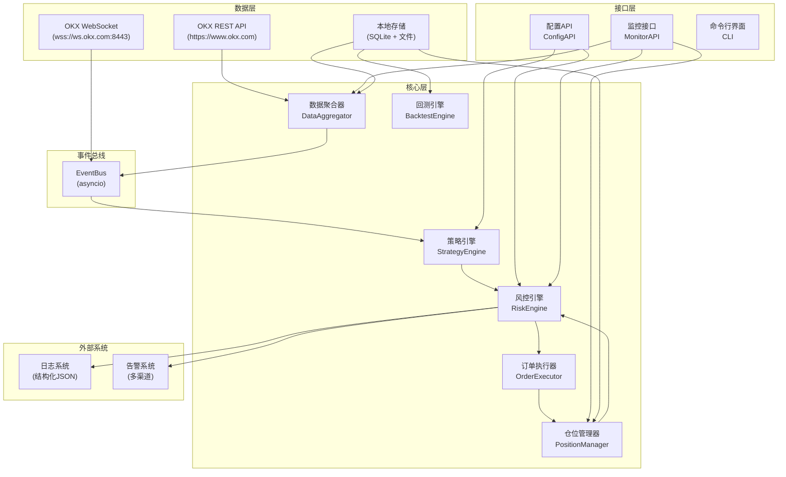
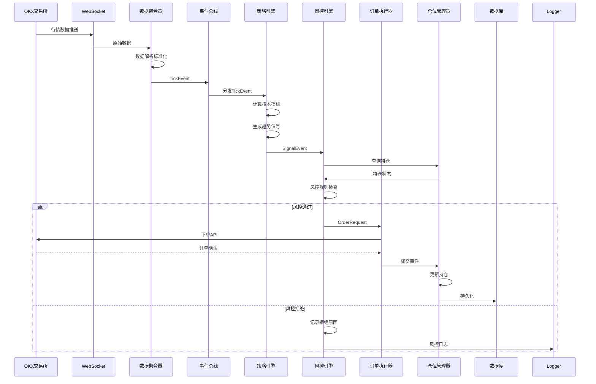
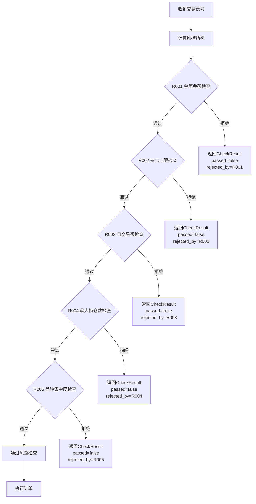
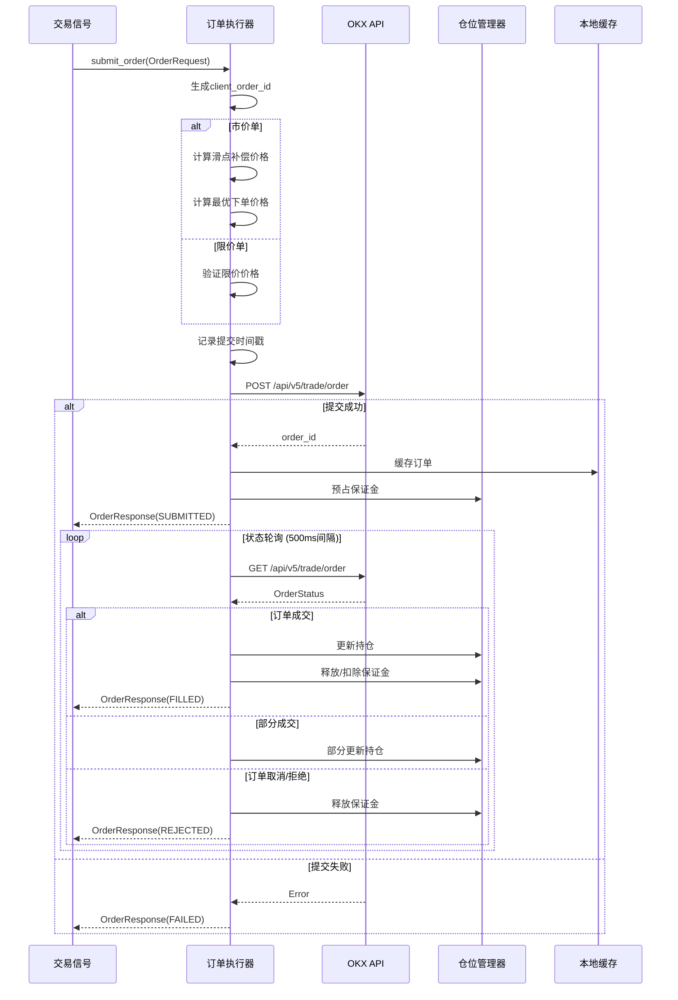
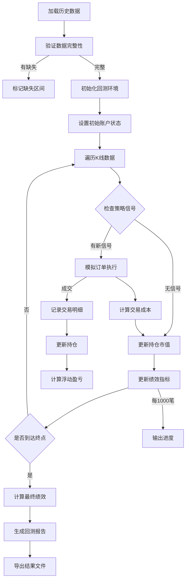
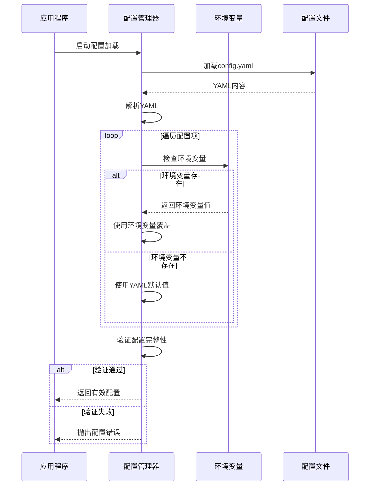
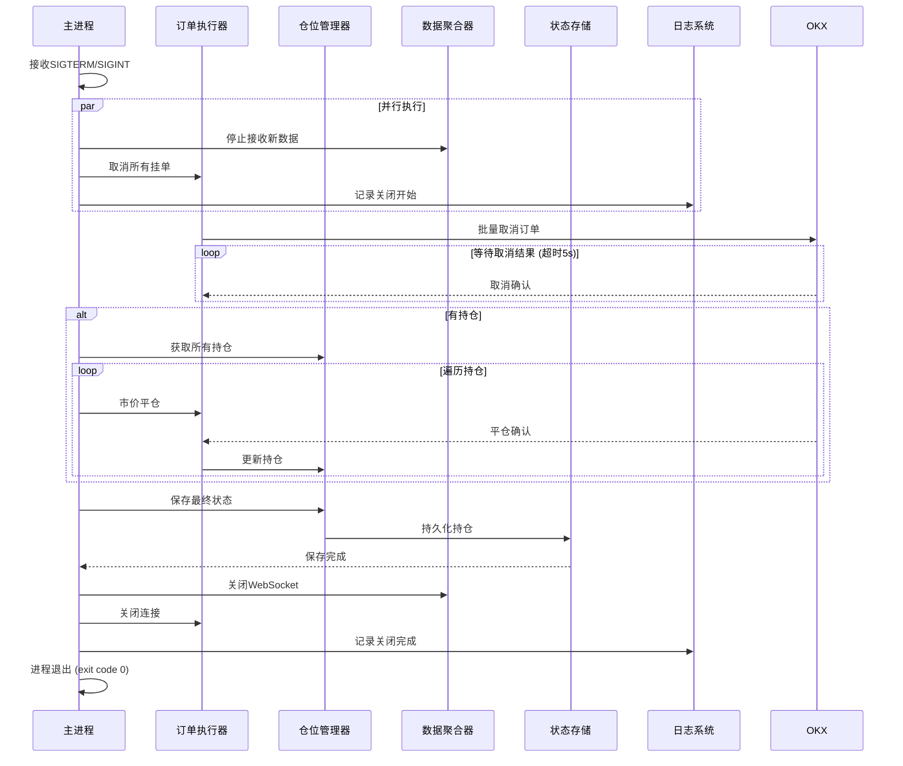

# 加密货币量化交易系统技术设计

## 版本信息

| 版本 | 日期 | 说明 |
|------|------|------|
| 1.0 | 2026-04-15 | 初始版本 |

---

## 描述

CRYPTO-TREND 是一款专注于OKX交易所的加密货币趋势跟踪量化交易系统。系统采用事件驱动架构，实现从市场数据采集、策略信号生成、订单执行到风险管理的全流程自动化。核心设计目标包括：毫秒级延迟性能、多层次风险控制、模块化可扩展架构。

---

## 词汇表

| 术语 | 英文 | 定义 |
|------|------|------|
| WebSocket | WebSocket | 双向实时通信协议，用于接收市场数据流 |
| REST API | REST API | 传统HTTP请求接口，用于查询历史数据和提交订单 |
| K线 | K-line / Candlestick | 也称蜡烛图，记录特定时间周期的开盘价、最高价、最低价、收盘价 |
| EMA | Exponential Moving Average | 指数移动平均线，对近期价格赋予更高权重的移动平均线 |
| RSI | Relative Strength Index | 相对强弱指数，衡量价格变动速度的动量指标，取值0-100 |
| ATR | Average True Range | 平均真实波幅，衡量市场波动性的指标 |
| 滑点 | Slippage | 预期成交价与实际成交价之间的偏差 |
| 仓位 | Position | 交易者持有的某种资产的数量和方向 |
| 多头 | Long | 看涨持仓，买入资产期待价格上涨 |
| 空头 | Short | 看跌持仓，卖出资产期待价格下跌 |
| 保证金 | Margin | 开仓时需要冻结的资金 |
| 浮动盈亏 | Unrealized PnL | 当前持仓按市价计算的理论盈亏 |
| 已实现盈亏 | Realized PnL | 已平仓交易的实际盈亏 |
| 置信度 | Confidence | 策略信号的可信程度，范围0.0到1.0 |
| 回测 | Backtest | 使用历史数据模拟交易策略进行验证 |
| 优雅关闭 | Graceful Shutdown | 系统收到停止信号后执行的安全关闭流程 |
| 标记价格 | Mark Price | 交易所用于计算浮动盈亏和强制平仓的价格 |
| 强平价格 | Liquidation Price | 仓位触发强制平仓的价格阈值 |
| 夏普比率 | Sharpe Ratio | 衡量策略风险调整后收益的指标 |
| 索提诺比率 | Sortino Ratio | 衡量下行风险调整后收益的指标 |
| 最大回撤 | Max Drawdown | 策略历史最高点到最低点的最大跌幅 |
| 盈亏比 | Profit Factor | 平均盈利金额与平均亏损金额的比值 |
| 胜率 | Win Rate | 盈利交易次数占总交易次数的比例 |

---

## 架构

### 设计原则

| 原则 | 描述 | 适用场景 |
|------|------|----------|
| 事件驱动 | 系统组件通过事件总线通信，降低耦合 | 数据流转、信号传递 |
| 反应式 | 组件对事件进行异步响应 | 订单处理、风控检查 |
| CQRS | 命令与查询分离 | 订单提交 vs 订单查询 |
| 资源池化 | 复用连接池、线程池减少开销 | 数据库、WebSocket连接 |
| Bulkhead | 隔离不同资源池 | 防止级联失败 |

### 整体架构图



### 核心流程



### 延迟预算分配

| 环节 | 目标 | P99上限 | 实现方式 |
|------|------|---------|----------|
| 数据接收解析 | 0.5ms | 1ms | 高效JSON解析器 |
| 数据分发 | 0.5ms | 1ms | asyncio事件循环 |
| 指标计算 | 3ms | 5ms | 向量化计算 numpy |
| 信号生成 | 2ms | 5ms | 预计算缓存 |
| 风控检查 | 1ms | 2ms | 内存查询 O(1) |
| 订单提交 | 8ms | 10ms | 连接池复用 |
| **端到端总计** | **15ms** | **20ms** | - |

---

## 组件设计

### 1. 数据聚合器 (Data Aggregator)

**需求对应**: REQ-001

#### 职责

- 管理与OKX WebSocket服务器的连接
- 订阅和处理行情数据
- 从REST API获取历史K线数据
- 数据标准化和缓存

#### 接口定义

| 方法 | 说明 | 输入 | 输出 | 延迟目标 |
|------|------|------|------|----------|
| `connect()` | 建立WebSocket连接 | 无 | ConnectionResult | < 3s |
| `subscribe(symbols)` | 订阅行情频道 | 交易对列表 | SubscribeResult | < 1s |
| `get_klines(symbol, interval, start, end)` | 获取K线数据 | 交易对,周期,起止时间 | KLine[] | < 500ms |
| `get_ticker(symbol)` | 获取最新行情 | 交易对 | Ticker | < 100ms |
| `disconnect()` | 断开连接 | 无 | void | < 1s |
| `on_tick(callback)` | 注册行情回调 | 回调函数 | void | - |

#### 数据结构

```python
# 数据模型
@dataclass(slots=True)
class KLine:
    timestamp: int       # UTC时间戳(毫秒)
    open: float          # 开盘价
    high: float          # 最高价
    low: float           # 最低价
    close: float         # 收盘价
    volume: float        # 成交量(币)
    quote_volume: float  # 成交额(USDT)
    
@dataclass(slots=True)
class Ticker:
    symbol: str          # 交易对 "BTC-USDT"
    last_price: float    # 最新价
    bid_price: float     # 买一价
    bid_qty: float       # 买一量
    ask_price: float     # 卖一价
    ask_qty: float       # 卖一量
    high_24h: float      # 24h最高价
    low_24h: float       # 24h最低价
    volume_24h: float    # 24h成交量
    timestamp: int       # 时间戳

# 事件模型
@dataclass
class TickEvent:
    symbol: str
    ticker: Ticker
    kline: Optional[KLine]
    timestamp: int
    latency_us: int  # 接收延迟(微秒)
```

#### WebSocket订阅格式

```python
# OKX WebSocket API v5 订阅格式
SUBSCRIBE_MESSAGE = {
    "op": "subscribe",
    "args": [
        {
            "channel": "tickers",
            "instId": "BTC-USDT"
        },
        {
            "channel": "candle1m",
            "instId": "BTC-USDT"
        }
    ]
}

# 响应数据解析
TICKER_DATA_FORMAT = {
    "instId": "BTC-USDT",
    "last": "65000.5",
    "bidPx": "64999.5",
    "bidSz": "0.1",
    "askPx": "65001.5",
    "askSz": "0.2",
    "high24h": "66000.0",
    "low24h": "64000.0",
    "vol24h": "12345.67",
    "ts": "1713001234567"
}
```

#### REST API端点

| 用途 | 方法 | 端点 | 频率限制 | 超时 |
|------|------|------|----------|------|
| 获取K线 | GET | /api/v5/market/candles | 20次/2s | 10s |
| 获取行情 | GET | /api/v5/market/ticker | 20次/2s | 10s |
| 获取订单簿 | GET | /api/v5/market/books | 20次/2s | 10s |
| 下单 | POST | /api/v5/trade/order | 60次/2s | 5s |
| 批量下单 | POST | /api/v5/trade/batch-orders | 60次/2s | 5s |
| 取消订单 | POST | /api/v5/trade/cancel-order | 60次/2s | 5s |
| 批量取消 | POST | /api/v5/trade/cancel-batch-orders | 60次/2s | 5s |
| 查订单 | GET | /api/v5/trade/order | 60次/2s | 5s |
| 查持仓 | GET | /api/v5/account/positions | 60次/2s | 5s |
| 查余额 | GET | /api/v5/account/balance | 60次/2s | 5s |

#### 重连策略

```python
RECONNECT_CONFIG = {
    "max_attempts": 5,
    "base_interval": 1.0,      # 秒
    "max_interval": 16.0,      # 秒
    "multiplier": 2.0,
    "jitter": True,             # 添加随机抖动
}

# 重连间隔: 1s -> 2s -> 4s -> 8s -> 16s (+/- 1s jitter)
```

#### 实现伪代码

```python
class DataAggregator:
    def __init__(self, config: Config, event_bus: EventBus):
        self.ws_client: WebSocketClient = None
        self.rest_client: RestClient = None
        self.event_bus = event_bus
        self.config = config
        self._subscriptions: set[str] = set()
        self._kline_cache: LRUCache[str, KLine] = LRUCache(maxsize=10000)
        self._reconnect_state = ReconnectState()
        
    async def connect(self) -> ConnectionResult:
        # 1. 创建WebSocket连接
        self.ws_client = await WebSocketClient.connect(
            url="wss://ws.okx.com:8443/ws/v5/public",
            timeout=10.0
        )
        
        # 2. 启动消息监听任务
        asyncio.create_task(self._message_listener())
        
        # 3. 返回连接结果
        return ConnectionResult(success=True, latency_ms=0)
        
    async def subscribe(self, symbols: list[str]) -> SubscribeResult:
        # 1. 构建订阅消息
        args = [
            {"channel": "tickers", "instId": s} for s in symbols
        ] + [
            {"channel": "candle1m", "instId": s} for s in symbols
        ]
        
        # 2. 发送订阅请求
        await self.ws_client.send({"op": "subscribe", "args": args})
        
        # 3. 等待确认
        response = await self.ws_client.receive()
        
        # 4. 更新订阅集合
        self._subscriptions.update(symbols)
        
        return SubscribeResult(success=True, symbols=symbols)
        
    async def _message_listener(self):
        """异步消息监听循环"""
        while True:
            try:
                message = await self.ws_client.receive()
                latency_us = (time.time_ns() - message["ts"]) * 1000
                
                # 解析并标准化数据 (< 1ms)
                event = self._parse_message(message, latency_us)
                
                # 发布到事件总线 (< 1ms)
                self.event_bus.publish(event)
                
            except WebSocketClosed:
                await self._handle_disconnect()
            except Exception as e:
                logger.error(f"Message parse error: {e}")
                
    def _parse_message(self, message: dict, latency_us: int) -> TickEvent:
        """消息解析 (< 1ms 目标)"""
        channel = message.get("channel")
        data = message.get("data", [{}])[0]
        
        if channel == "tickers":
            return self._parse_ticker(data, latency_us)
        elif channel.startswith("candle"):
            return self._parse_kline(data, latency_us)
```

---

### 2. 策略引擎 (Strategy Engine)

**需求对应**: REQ-002

#### 职责

- 计算技术指标 (EMA, RSI, ATR, MACD)
- 根据指标生成趋势交易信号
- 计算止损止盈价格
- 评估信号置信度

#### 接口定义

| 方法 | 说明 | 输入 | 输出 | 延迟目标 |
|------|------|------|------|----------|
| `calculate_indicators(klines)` | 计算技术指标 | K线数据 | IndicatorSet | < 3ms |
| `generate_signal(indicators)` | 生成交易信号 | 指标集 | TrendSignal | < 2ms |
| `set_parameters(params)` | 设置策略参数 | 参数映射 | void | - |
| `get_parameters()` | 获取策略参数 | 无 | StrategyParams | - |

#### 指标计算规格

| 指标 | 周期 | 公式 | 实现复杂度 |
|------|------|------|------------|
| EMA | 5 | `EMA_t = price_t × k + EMA_{t-1} × (1-k)`, k=2/(n+1) | O(1) |
| EMA | 20 | 同上 | O(1) |
| EMA | 50 | 同上 | O(1) |
| RSI | 14 | `100 - 100/(1+RS)`, RS=AvgGain/AvgLoss | O(n) |
| ATR | 14 | `Avg(TrueRange)`, TR=max(H-L, |H-PC|, |L-PC|) | O(n) |
| MACD | 12/26/9 | `EMA12 - EMA26`, Signal=EMA9(MACD) | O(1) |

#### 数据结构

```python
class SignalDirection(Enum):
    BUY = "buy"
    SELL = "sell"
    NEUTRAL = "neutral"

@dataclass(slots=True)
class IndicatorSet:
    # 移动平均线
    ema5: float           # 5周期EMA
    ema20: float          # 20周期EMA
    ema50: float          # 50周期EMA
    ema_convergence: float  # EMA收敛度 (-1 到 1)
    
    # 动量指标
    rsi: float             # 0-100
    macd: float            # MACD线
    macd_signal: float     # 信号线
    macd_histogram: float  # MACD柱
    
    # 波动率指标
    atr: float             # 平均真实波幅
    atr_percent: float     # ATR百分比
    
    # 复合指标
    trend_strength: float  # 趋势强度 (0 到 1)
    
@dataclass(slots=True)
class TrendSignal:
    id: str                     # UUID
    symbol: str                 # 交易对
    direction: SignalDirection  # 方向
    entry_price: float          # 入场价格
    stop_loss: float            # 止损价格
    take_profit: float          # 止盈价格
    confidence: float           # 置信度 0.0-1.0
    indicators: IndicatorSet   # 指标快照
    reason: str                 # 生成原因
    timestamp: int              # 生成时间(ms)
    expires_at: int            # 过期时间(ms)
    
@dataclass
class StrategyParams:
    # 指标参数
    ema_periods: list[int] = field(default_factory=lambda: [5, 20, 50])
    rsi_period: int = 14
    atr_period: int = 14
    macd_fast: int = 12
    macd_slow: int = 26
    macd_signal: int = 9
    
    # 入场参数
    min_confidence: float = 0.65
    ema_convergence_threshold: float = 0.002
    trend_strength_threshold: float = 0.6
    
    # 出场参数
    stop_loss_atr_multiplier: float = 2.0
    take_profit_atr_multiplier: float = 3.0
    signal_validity_seconds: int = 300  # 5分钟
```

#### 信号生成规则

```python
def generate_signal(self, indicators: IndicatorSet, price: float) -> TrendSignal:
    """
    趋势跟踪信号生成逻辑
    
    买入条件:
    1. EMA5 > EMA20 > EMA50 (上升趋势)
    2. EMA收敛度 > 阈值 (趋势确认)
    3. RSI < 70 (非超买)
    4. 置信度 >= 最低阈值
    
    卖出条件:
    1. EMA5 < EMA20 < EMA50 (下降趋势)
    2. EMA收敛度 < -阈值 (趋势确认)
    3. RSI > 30 (非超卖)
    4. 置信度 >= 最低阈值
    """
    # 计算置信度
    confidence = self._calculate_confidence(indicators)
    
    # 检查最低置信度
    if confidence < self.params.min_confidence:
        return TrendSignal(direction=SignalDirection.NEUTRAL, ...)
    
    # 检查趋势方向
    if self._is_uptrend(indicators):
        stop_loss = price - indicators.atr * self.params.stop_loss_atr_multiplier
        take_profit = price + indicators.atr * self.params.take_profit_atr_multiplier
        
        return TrendSignal(
            direction=SignalDirection.BUY,
            entry_price=price,
            stop_loss=stop_loss,
            take_profit=take_profit,
            confidence=confidence,
            ...
        )
    
    elif self._is_downtrend(indicators):
        stop_loss = price + indicators.atr * self.params.stop_loss_atr_multiplier
        take_profit = price - indicators.atr * self.params.take_profit_atr_multiplier
        
        return TrendSignal(
            direction=SignalDirection.SELL,
            entry_price=price,
            stop_loss=stop_loss,
            take_profit=take_profit,
            confidence=confidence,
            ...
        )
    
    return TrendSignal(direction=SignalDirection.NEUTRAL, ...)

def _calculate_confidence(self, indicators: IndicatorSet) -> float:
    """计算信号置信度 (0.0 - 1.0)"""
    
    # EMA收敛度评分 (权重 40%)
    ema_score = min(abs(indicators.ema_convergence) / 0.01, 1.0)
    
    # RSI位置评分 (权重 30%)
    # RSI在50附近评分最高，越极端评分越低
    rsi_score = 1.0 - abs(indicators.rsi - 50) / 50
    
    # ATR波动率评分 (权重 30%)
    # 适中的波动率最佳，过高或过低都不好
    atr_score = min(indicators.atr_percent / 5.0, 1.0) if indicators.atr_percent < 5.0 else 1.0
    
    return 0.4 * ema_score + 0.3 * rsi_score + 0.3 * atr_score

def _is_uptrend(self, indicators: IndicatorSet) -> bool:
    """判断是否处于上升趋势"""
    return (
        indicators.ema5 > indicators.ema20 > indicators.ema50 and
        indicators.ema_convergence > self.params.ema_convergence_threshold and
        indicators.rsi < 70 and
        indicators.trend_strength > self.params.trend_strength_threshold
    )
```

#### 指标缓存策略

```python
class IndicatorCache:
    """指标缓存，减少重复计算"""
    
    def __init__(self, max_symbols: int = 100):
        self._cache: dict[str, IndicatorState] = {}
        self._ema_buffers: dict[str, list[float]] = {}
        self._rsi_buffers: dict[str, list[float]] = {}
        
    def update(self, symbol: str, kline: KLine) -> IndicatorSet:
        """更新指标计算"""
        # 维护EMA缓冲区
        if symbol not in self._ema_buffers:
            self._ema_buffers[symbol] = []
            self._rsi_buffers[symbol] = []
        
        # 添加新价格
        self._ema_buffers[symbol].append(kline.close)
        if len(self._ema_buffers[symbol]) > 50:
            self._ema_buffers[symbol].pop(0)
        
        # 计算EMA
        ema5 = self._calc_ema(self._ema_buffers[symbol], 5)
        ema20 = self._calc_ema(self._ema_buffers[symbol], 20)
        ema50 = self._calc_ema(self._ema_buffers[symbol], 50)
        
        # 计算EMA收敛度
        ema_convergence = (ema5 - ema20) / ema50
        
        # 计算RSI
        rsi = self._calc_rsi(self._rsi_buffers[symbol])
        
        # 计算ATR
        atr = self._calc_atr(kline)
        
        return IndicatorSet(
            ema5=ema5,
            ema20=ema20,
            ema50=ema50,
            ema_convergence=ema_convergence,
            rsi=rsi,
            atr=atr,
            ...
        )
```

---

### 3. 风控引擎 (Risk Engine)

**需求对应**: REQ-004

#### 职责

- 订单风控前置检查
- 持仓风险实时监控
- 动态风控限额调整
- 紧急止损触发

#### 接口定义

| 方法 | 说明 | 输入 | 输出 | 延迟目标 |
|------|------|------|------|----------|
| `check_order(signal, balance)` | 检查订单风险 | 信号,余额 | CheckResult | < 1ms |
| `check_portfolio(positions)` | 检查组合风险 | 持仓列表 | PortfolioRisk | < 10ms |
| `get_limits()` | 获取风控限额 | 无 | RiskLimits | - |
| `update_limits(limits)` | 更新风控限额 | 限额参数 | void | < 1s |
| `trigger_stop_loss(position)` | 触发止损 | 持仓 | StopLossResult | < 100ms |
| `on_risk_event(callback)` | 注册风险事件回调 | 回调函数 | void | - |

#### 风控规则实现

```python
@dataclass(slots=True)
class RiskLimits:
    # 订单限额
    max_single_order_ratio: float = 0.10     # 单笔金额上限 10%
    max_position_ratio: float = 0.20         # 持仓上限 20%
    max_daily_trade_ratio: float = 2.0      # 日交易额上限 200%
    max_positions: int = 5                   # 最大持仓数
    
    # 集中度
    max_concentration: float = 0.30          # 单品种上限 30%
    
    # 止损
    warning_ratio: float = 0.05              # 预警线 5%
    auto_stop_ratio: float = 0.10            # 自动止损 10%
    
    # 紧急
    max_drawdown_limit: float = 0.20         # 最大回撤限制
    circuit_breaker_trades: int = 10         # 熔断交易数
    circuit_breaker_period: int = 300       # 熔断周期(秒)

@dataclass(slots=True)
class CheckResult:
    passed: bool
    rejected_by: Optional[str]          # 规则ID 如 "R001"
    rejected_reason: Optional[str]
    risk_metrics: 'RiskMetrics'
    timestamp: int

@dataclass(slots=True)
class RiskMetrics:
    order_amount: float           # 订单金额
    position_value: float         # 持仓价值
    daily_trade_value: float      # 日交易额
    position_count: int           # 持仓数量
    concentration: float          # 集中度
    unrealized_pnl_ratio: float   # 浮动盈亏比例
    margin_ratio: float           # 保证金比例

class RiskEngine:
    def __init__(self, config: Config, position_manager: PositionManager):
        self._limits = RiskLimits()
        self._pm = position_manager
        self._daily_stats = DailyStats()
        self._event_callbacks: list[Callable] = []
        
    def check_order(self, signal: TrendSignal, balance: float) -> CheckResult:
        """
        订单风控前置检查 (< 1ms)
        
        检查规则顺序:
        R001 -> R002 -> R003 -> R004 -> R005
        """
        # 计算风控指标
        metrics = self._calculate_metrics(signal, balance)
        
        # R001: 单笔金额检查
        order_amount = signal.entry_price * self._calculate_order_size(signal)
        max_order_amount = balance * self._limits.max_single_order_ratio
        if order_amount > max_order_amount:
            return self._reject("R001", "单笔金额超限", metrics)
        
        # R002: 持仓上限检查
        current_position_value = self._pm.get_total_position_value()
        new_position_value = current_position_value + order_amount
        max_position_value = balance * self._limits.max_position_ratio
        if new_position_value > max_position_value:
            return self._reject("R002", "持仓金额超限", metrics)
        
        # R003: 日交易额检查
        daily_volume = self._daily_stats.get_total_volume()
        new_daily_volume = daily_volume + order_amount
        max_daily_volume = balance * self._limits.max_daily_trade_ratio
        if new_daily_volume > max_daily_volume:
            return self._reject("R003", "日交易额超限", metrics)
        
        # R004: 最大持仓数检查
        if signal.direction != SignalDirection.NEUTRAL:
            if self._pm.get_position_count() >= self._limits.max_positions:
                return self._reject("R004", "持仓数量超限", metrics)
        
        # R005: 品种集中度检查
        symbol_value = self._pm.get_position_value(signal.symbol)
        new_symbol_value = symbol_value + order_amount
        concentration = new_symbol_value / balance
        if concentration > self._limits.max_concentration:
            return self._reject("R005", "品种集中度超限", metrics)
        
        return CheckResult(passed=True, risk_metrics=metrics)
        
    def check_portfolio(self) -> PortfolioRisk:
        """组合风险检查 (< 10ms)"""
        positions = self._pm.get_positions()
        balance = self._pm.get_balance()
        
        total_exposure = sum(p.unrealized_pnl for p in positions)
        margin_used = sum(p.margin for p in positions)
        margin_ratio = margin_used / balance if balance > 0 else 0
        
        # 计算净敞口
        long_exposure = sum(p.unrealized_pnl for p in positions if p.side == PositionSide.LONG)
        short_exposure = sum(p.unrealized_pnl for p in positions if p.side == PositionSide.SHORT)
        net_exposure = long_exposure - short_exposure
        
        # 风险等级评估
        risk_level = self._evaluate_risk_level(margin_ratio, total_exposure / balance)
        
        return PortfolioRisk(
            total_exposure=total_exposure,
            net_exposure=net_exposure,
            margin_used=margin_used,
            margin_available=balance - margin_used,
            margin_ratio=margin_ratio,
            risk_level=risk_level
        )
```

#### 风控检查流程



#### 动态限额调整

```python
async def update_limits(self, new_limits: RiskLimits) -> None:
    """
    运行时动态调整风控限额 (< 1s 生效)
    
    实现方式:
    1. 验证新限额的合法性
    2. 原子性更新限额配置
    3. 记录配置变更日志
    4. 触发配置变更事件
    """
    # 验证新限额
    self._validate_limits(new_limits)
    
    # 原子性更新
    old_limits = self._limits
    self._limits = new_limits
    
    # 审计日志
    logger.info(f"Risk limits updated: {old_limits} -> {new_limits}")
    
    # 发布配置变更事件
    self.event_bus.publish(ConfigChangeEvent(
        config_type="risk_limits",
        old_value=old_limits,
        new_value=new_limits,
        timestamp=int(time.time() * 1000)
    ))
```

---

### 4. 订单执行器 (Order Executor)

**需求对应**: REQ-003

#### 职责

- 订单创建和提交
- 订单状态跟踪
- 订单取消管理
- 滑点控制

#### 接口定义

| 方法 | 说明 | 输入 | 输出 | 延迟目标 |
|------|------|------|------|----------|
| `submit_order(order)` | 提交订单 | OrderRequest | OrderResponse | < 10ms |
| `cancel_order(order_id, symbol)` | 取消订单 | 订单ID,交易对 | CancelResult | < 100ms |
| `cancel_all_orders(symbol)` | 取消所有订单 | 交易对 | list[CancelResult] | < 500ms |
| `get_order_status(order_id, symbol)` | 查询订单状态 | 订单ID,交易对 | OrderStatus | < 50ms |
| `get_balance()` | 获取账户余额 | 无 | Balance | < 50ms |
| `get_open_orders(symbol)` | 获取挂单 | 交易对 | list[Order] | < 100ms |

#### 数据结构

```python
class OrderSide(Enum):
    BUY = "buy"
    SELL = "sell"

class OrderType(Enum):
    MARKET = "market"
    LIMIT = "limit"

class OrderStatus(Enum):
    PENDING = "pending"              # 待提交
    SUBMITTED = "submitted"           # 已提交
    PARTIAL_FILLED = "partial_filled" # 部分成交
    FILLED = "filled"                # 全部成交
    CANCELLED = "cancelled"          # 已取消
    REJECTED = "rejected"            # 已拒绝
    EXPIRED = "expired"             # 已过期
    FAILED = "failed"                # 失败

@dataclass(slots=True)
class OrderRequest:
    symbol: str              # 交易对 "BTC-USDT"
    side: OrderSide          # 买入/卖出
    order_type: OrderType   # 市价/限价
    price: Optional[float]  # 限价单价格
    quantity: float         # 数量(币)
    client_order_id: str    # 客户端订单ID (唯一)
    reduce_only: bool = False  # 只平仓
    
    # 内部字段
    signal_id: Optional[str] = None  # 关联信号ID
    submitted_at: Optional[int] = None

@dataclass(slots=True)
class OrderResponse:
    order_id: str           # 交易所订单ID
    client_order_id: str    # 客户端订单ID
    symbol: str             # 交易对
    status: OrderStatus    # 订单状态
    side: OrderSide        # 买入/卖出
    order_type: OrderType # 订单类型
    price: float          # 委托价格
    quantity: float       # 委托数量
    filled_qty: float     # 已成交数量
    avg_price: float      # 成交均价
    fee: float            # 手续费
    timestamp: int         # 创建时间(ms)
    updated_at: int        # 更新时间(ms)
    
    # 延迟指标
    submit_latency_ms: float = 0   # 提交延迟
    fill_latency_ms: float = 0     # 成交延迟

@dataclass(slots=True)
class Balance:
    total_equity: float        # 总权益(USDT)
    available: float           # 可用余额
    margin_used: float         # 已用保证金
    margin_available: float   # 可用保证金
    positions: list[Position]  # 持仓列表
```

#### 订单执行流程



#### 滑点控制

```python
class SlippageController:
    """滑点控制器"""
    
    def __init__(self, config: Config):
        self.slippage_rate = config.get("execution.slippage", 0.0005)
        
    def calculate_execution_price(
        self,
        side: OrderSide,
        market_price: float,
        order_type: OrderType
    ) -> float:
        """
        计算最优执行价格
        
        市价单: 加上滑点补偿
        限价单: 使用指定价格
        """
        if order_type == OrderType.MARKET:
            if side == OrderSide.BUY:
                # 买入: 提高价格确保成交
                return market_price * (1 + self.slippage_rate)
            else:
                # 卖出: 降低价格确保成交
                return market_price * (1 - self.slippage_rate)
        else:
            # 限价单使用指定价格
            return market_price
            
    def validate_fill_price(
        self,
        submitted_price: float,
        fill_price: float,
        side: OrderSide
    ) -> tuple[bool, float]:
        """
        验证成交价格是否在可接受范围内
        
        Returns:
            (是否有效, 滑点百分比)
        """
        slippage = abs(fill_price - submitted_price) / submitted_price
        
        if slippage > 0.001:  # 0.1%
            return False, slippage
        return True, slippage
```

#### OKX下单API格式

```python
# POST /api/v5/trade/order 请求格式
ORDER_REQUEST_FORMAT = {
    "instId": "BTC-USDT",       # 交易品种
    "tdMode": "isolated",       # 仓位模式: isolated/cross
    "side": "buy",              # 买入/卖出
    "ordType": "market",        # 订单类型: market/limit
    "sz": "0.01",               # 数量
    "clOrdId": "client_001",    # 客户端订单ID
    "reduceOnly": "false",      # 只平仓
    "tag": "trend_signal"       # 订单标签
}

# 响应格式
ORDER_RESPONSE_FORMAT = {
    "code": "0",                # 0表示成功
    "msg": "",
    "data": [{
        "clOrdId": "client_001",
        "ordId": "123456789",
        "sCode": "0",
        "sMsg": ""
    }]
}
```

---

### 5. 仓位管理器 (Position Manager)

**需求对应**: REQ-003, REQ-004

#### 职责

- 持仓状态管理
- 盈亏计算
- 保证金管理
- 状态持久化

#### 接口定义

| 方法 | 说明 | 输入 | 输出 | 延迟目标 |
|------|------|------|------|----------|
| `open_position(position)` | 开仓 | Position | OpenResult | < 10ms |
| `close_position(symbol, quantity)` | 平仓 | 交易对,数量 | CloseResult | < 10ms |
| `update_position(position)` | 更新持仓 | Position | void | - |
| `get_positions()` | 获取所有持仓 | 无 | list[Position] | < 5ms |
| `get_position(symbol)` | 获取指定持仓 | 交易对 | Optional[Position] | < 1ms |
| `calculate_pnl()` | 计算盈亏 | 无 | PnLReport | < 10ms |
| `persist_state()` | 持久化状态 | 无 | void | < 100ms |
| `load_state()` | 加载状态 | 无 | void | < 1s |

#### 数据结构

```python
class PositionSide(Enum):
    LONG = "long"
    SHORT = "short"

@dataclass(slots=True)
class Position:
    id: str                  # 持仓唯一ID
    symbol: str              # 交易对
    side: PositionSide       # 多头/空头
    quantity: float           # 持仓数量
    entry_price: float       # 开仓均价
    current_price: float     # 当前价格
    mark_price: float       # 标记价格
    liquidation_price: float # 强平价格
    leverage: float           # 杠杆倍数
    margin: float            # 占用保证金
    unrealized_pnl: float    # 浮动盈亏
    realized_pnl: float       # 已实现盈亏
    opening_timestamp: int  # 开仓时间(ms)
    updated_at: int         # 更新时间(ms)

@dataclass(slots=True)
class PnLReport:
    # 总体统计
    total_realized_pnl: float     # 累计已实现盈亏
    total_unrealized_pnl: float   # 累计浮动盈亏
    total_trade_count: int        # 累计交易次数
    
    # 交易统计
    winning_trades: int           # 盈利交易次数
    losing_trades: int            # 亏损交易次数
    win_rate: float               # 胜率
    avg_win: float                # 平均盈利
    avg_loss: float               # 平均亏损
    profit_factor: float          # 盈亏比
    
    # 风险统计
    max_drawdown: float           # 最大回撤
    max_drawdown_ratio: float     # 最大回撤比例
    current_drawdown: float       # 当前回撤
    current_drawdown_ratio: float
    
    # 持仓统计
    avg_holding_time_hours: float # 平均持仓时间
    largest_position: float       # 最大持仓
    avg_position: float           # 平均持仓
```

#### 盈亏计算

```python
def calculate_unrealized_pnl(position: Position) -> float:
    """计算浮动盈亏"""
    if position.side == PositionSide.LONG:
        return (position.current_price - position.entry_price) * position.quantity
    else:
        return (position.entry_price - position.current_price) * position.quantity

def calculate_realized_pnl(
    entry_price: float,
    exit_price: float,
    quantity: float,
    side: PositionSide,
    fee: float
) -> float:
    """计算已实现盈亏"""
    if side == PositionSide.LONG:
        gross_pnl = (exit_price - entry_price) * quantity
    else:
        gross_pnl = (entry_price - exit_price) * quantity
    
    return gross_pnl - fee

def calculate_portfolio_metrics(positions: list[Position], balance: float) -> PortfolioMetrics:
    """计算组合指标"""
    total_exposure = sum(abs(p.unrealized_pnl) for p in positions)
    net_exposure = sum(p.unrealized_pnl for p in positions)
    
    # 保证金使用率
    total_margin = sum(p.margin for p in positions)
    margin_ratio = total_margin / balance if balance > 0 else 0
    
    # 多空比
    long_value = sum(p.unrealized_pnl for p in positions if p.side == PositionSide.LONG)
    short_value = sum(p.unrealized_pnl for p in positions if p.side == PositionSide.SHORT)
    long_short_ratio = long_value / abs(short_value) if short_value != 0 else float('inf')
    
    return PortfolioMetrics(
        total_exposure=total_exposure,
        net_exposure=net_exposure,
        margin_ratio=margin_ratio,
        long_short_ratio=long_short_ratio,
        position_count=len(positions)
    )
```

#### 状态持久化

```python
class StateManager:
    """状态管理器"""
    
    def __init__(self, storage: SQLiteStorage):
        self.storage = storage
        self._state_version = 1
        
    async def persist_state(self, positions: dict[str, Position], daily_stats: DailyStats):
        """
        持久化当前状态 (< 100ms)
        
        持久化内容:
        1. 当前持仓状态
        2. 当日交易统计
        3. 最后持久化时间
        """
        state = {
            "version": self._state_version,
            "timestamp": int(time.time() * 1000),
            "positions": {
                symbol: {
                    "id": p.id,
                    "symbol": p.symbol,
                    "side": p.side.value,
                    "quantity": str(p.quantity),
                    "entry_price": str(p.entry_price),
                    "leverage": p.leverage,
                    "margin": str(p.margin),
                    "opening_timestamp": p.opening_timestamp
                }
                for symbol, p in positions.items()
            },
            "daily_stats": daily_stats.to_dict()
        }
        
        await self.storage.save("system_state", state)
        
    async def load_state(self) -> Optional[dict]:
        """从存储加载状态 (< 1s)"""
        state = await self.storage.load("system_state")
        
        if state:
            # 验证版本
            if state.get("version") != self._state_version:
                logger.warn(f"State version mismatch: {state.get('version')} != {self._state_version}")
                
            return state
            
        return None
```

---

### 6. 回测引擎 (Backtest Engine)

**需求对应**: REQ-005

#### 职责

- 历史数据加载和缓存
- 策略回测执行
- 绩效指标计算
- 报告生成

#### 接口定义

| 方法 | 说明 | 输入 | 输出 |
|------|------|------|------|
| `load_data(symbol, start, end)` | 加载历史数据 | 交易对,起止时间 | DataFrame |
| `run(config)` | 执行回测 | BacktestConfig | BacktestResult |
| `optimize(param_grid)` | 参数优化 | 参数网格 | OptimizationResult |
| `export_results(format)` | 导出结果 | 格式(csv/json) | 文件路径 |

#### 回测配置

```python
@dataclass
class BacktestConfig:
    # 账户配置
    initial_capital: float = 100000.0     # 初始资金
    commission_rate: float = 0.0005      # 手续费率
    slippage: float = 0.0005             # 滑点
    
    # 回测范围
    start_date: str = "2024-01-01"       # 开始日期
    end_date: str = "2024-12-31"        # 结束日期
    symbols: list[str] = field(default_factory=lambda: ["BTC-USDT"])
    timeframe: str = "1h"               # 时间周期
    
    # 策略参数
    strategy_params: StrategyParams = None
    
    # 执行配置
    progress_interval: int = 1000       # 进度报告间隔(笔)
    checkpoint_enabled: bool = True     # 启用断点恢复
    checkpoint_path: str = "./data/backtest/checkpoint.json"

@dataclass
class BacktestResult:
    # 基本信息
    config: BacktestConfig
    start_date: str
    end_date: str
    total_days: int
    
    # 收益指标
    initial_capital: float
    final_capital: float
    total_return: float            # 总收益率
    annualized_return: float       # 年化收益率
    
    # 风险指标
    sharpe_ratio: float           # 夏普比率
    sortino_ratio: float          # 索提诺比率
    max_drawdown: float           # 最大回撤
    max_drawdown_ratio: float     # 最大回撤比例
    max_drawdown_duration: int    # 最大回撤持续天数
    current_drawdown: float       # 当前回撤
    
    # 交易统计
    total_trades: int            # 总交易次数
    winning_trades: int          # 盈利次数
    losing_trades: int           # 亏损次数
    win_rate: float              # 胜率
    avg_win: float               # 平均盈利
    avg_loss: float              # 平均亏损
    profit_factor: float         # 盈亏比
    avg_trade_duration: float   # 平均持仓时间(小时)
    
    # 月度收益
    monthly_returns: dict[str, float]  # {yyyy-mm: return}
    
    # 详细交易记录
    trades: list[TradeRecord]
```

#### 回测流程



#### 绩效指标计算

```python
def calculate_sharpe_ratio(returns: list[float], risk_free_rate: float = 0.0) -> float:
    """计算夏普比率"""
    if not returns:
        return 0.0
    
    avg_return = np.mean(returns)
    std_return = np.std(returns)
    
    if std_return == 0:
        return 0.0
        
    return (avg_return - risk_free_rate) / std_return * np.sqrt(252)

def calculate_sortino_ratio(returns: list[float], risk_free_rate: float = 0.0) -> float:
    """计算索提诺比率"""
    if not returns:
        return 0.0
    
    avg_return = np.mean(returns)
    downside_returns = [r for r in returns if r < 0]
    
    if not downside_returns:
        return float('inf') if avg_return > 0 else 0.0
        
    downside_std = np.std(downside_returns)
    
    if downside_std == 0:
        return 0.0
        
    return (avg_return - risk_free_rate) / downside_std * np.sqrt(252)

def calculate_max_drawdown(equity_curve: list[float]) -> tuple[float, float, int]:
    """
    计算最大回撤
    
    Returns:
        (最大回撤金额, 最大回撤比例, 持续天数)
    """
    if not equity_curve:
        return 0.0, 0.0, 0
        
    peak = equity_curve[0]
    peak_idx = 0
    max_dd = 0.0
    max_dd_ratio = 0.0
    
    for i, value in enumerate(equity_curve):
        if value > peak:
            peak = value
            peak_idx = i
            
        dd = peak - value
        dd_ratio = dd / peak if peak > 0 else 0
        
        if dd > max_dd:
            max_dd = dd
            max_dd_ratio = dd_ratio
            
    return max_dd, max_dd_ratio, 0  # 简化实现
```

---

### 7. 监控与告警系统

**需求对应**: REQ-006

#### 监控指标体系

```python
@dataclass(slots=True)
class SystemMetrics:
    # 性能指标
    data_processing_latency_p99_ms: float    # 数据处理延迟 P99
    strategy_calculation_latency_p99_ms: float  # 策略计算延迟 P99
    order_submission_latency_p99_ms: float   # 订单提交延迟 P99
    end_to_end_latency_p99_ms: float         # 端到端延迟 P99
    
    # 业务指标
    total_positions: int                      # 当前持仓数
    open_orders_count: int                   # 挂单数量
    daily_trade_count: int                   # 今日交易数
    daily_trade_volume: float                # 今日交易额
    total_realized_pnl: float               # 累计已实现盈亏
    total_unrealized_pnl: float             # 累计浮动盈亏
    daily_pnl: float                        # 今日盈亏
    
    # 系统指标
    cpu_usage_percent: float                # CPU使用率
    memory_usage_mb: float                  # 内存使用(MB)
    memory_usage_percent: float              # 内存使用率
    network_latency_ms: float               # 网络延迟
    websocket_connected: bool               # WebSocket连接状态
    database_connected: bool               # 数据库连接状态
    
    # 订单指标
    order_success_rate: float               # 订单成功率
    avg_fill_slippage: float               # 平均滑点
    avg_order_latency_ms: float             # 平均订单延迟
    total_orders_today: int               # 今日订单总数
    failed_orders_today: int              # 今日失败订单数

@dataclass(slots=True)
class AlertEvent:
    level: AlertLevel           # INFO/WARN/ERROR/FATAL
    source: str                 # 告警来源
    message: str               # 告警消息
    details: dict              # 详细信息
    timestamp: int             # 发生时间(ms)
    recovered: bool = False    # 是否已恢复
```

#### 告警阈值

| 指标 | INFO | WARN | ERROR | FATAL |
|------|------|------|-------|-------|
| CPU使用率 | > 50% | > 70% | > 85% | > 95% |
| 内存使用率 | > 60% | > 75% | > 90% | > 95% |
| 订单失败率 | > 1% | > 3% | > 5% | > 10% |
| 延迟P99 | > 10ms | > 20ms | > 50ms | > 100ms |
| 日亏损 | > 3% | > 5% | > 8% | > 10% |
| WebSocket断开 | - | 断开 | - | - |
| 连续订单失败 | - | 3次 | 5次 | 10次 |

#### 告警规则配置

```python
ALERT_RULES: list[AlertRule] = [
    # 系统资源告警
    AlertRule("WARN", "CPU使用率过高", lambda m: m.cpu_usage_percent > 70),
    AlertRule("ERROR", "CPU使用率严重过高", lambda m: m.cpu_usage_percent > 85),
    AlertRule("WARN", "内存使用率过高", lambda m: m.memory_usage_percent > 75),
    AlertRule("ERROR", "内存使用率严重过高", lambda m: m.memory_usage_percent > 90),
    
    # 连接状态告警
    AlertRule("ERROR", "WebSocket连接断开", lambda m: not m.websocket_connected),
    AlertRule("ERROR", "数据库连接断开", lambda m: not m.database_connected),
    
    # 性能告警
    AlertRule("WARN", "数据处理延迟过高", lambda m: m.data_processing_latency_p99_ms > 5),
    AlertRule("ERROR", "数据处理延迟严重过高", lambda m: m.data_processing_latency_p99_ms > 10),
    AlertRule("WARN", "端到端延迟过高", lambda m: m.end_to_end_latency_p99_ms > 20),
    
    # 交易告警
    AlertRule("WARN", "订单失败率过高", lambda m: m.order_success_rate < 0.97),
    AlertRule("ERROR", "订单失败率严重过高", lambda m: m.order_success_rate < 0.95),
    AlertRule("WARN", "日亏损超过5%", lambda m: m.daily_pnl < -0.05),
    AlertRule("ERROR", "日亏损超过8%", lambda m: m.daily_pnl < -0.08),
    AlertRule("FATAL", "日亏损超过10%", lambda m: m.daily_pnl < -0.10),
]
```

#### 日志格式

```python
# 结构化JSON日志格式
LOG_FORMAT = {
    "timestamp": "2026-04-15T10:30:00.123Z",
    "level": "INFO",
    "logger": "RiskEngine",
    "message": "Order rejected by risk check",
    "details": {
        "symbol": "BTC-USDT",
        "reason": "R001",
        "order_amount": 50000.0,
        "max_allowed": 10000.0
    },
    "trace_id": "uuid-xxx",
    "span_id": "span-yyy"
}

# 交易日志格式
TRADE_LOG_FORMAT = {
    "timestamp": "2026-04-15T10:30:00.123Z",
    "event": "ORDER_SUBMITTED",
    "order_id": "123456",
    "client_order_id": "client-001",
    "symbol": "BTC-USDT",
    "side": "BUY",
    "order_type": "MARKET",
    "price": 65000.0,
    "quantity": 0.1,
    "signal_id": "signal-xxx",
    "latency_ms": {
        "signal_to_submit": 15,
        "api_call": 8
    }
}
```

---

### 8. 配置管理系统

**需求对应**: REQ-007

#### 配置加载流程



#### 配置验证规则

```python
CONFIG_VALIDATORS = {
    "exchange.api_key": lambda v: v is not None and len(v) > 0,
    "exchange.secret_key": lambda v: v is not None and len(v) > 0,
    "exchange.passphrase": lambda v: v is not None and len(v) > 0,
    "symbols": lambda v: isinstance(v, list) and len(v) > 0,
    "symbols.*": lambda v: re.match(r"^[A-Z]+-USDT$", v),
    
    "strategy.min_confidence": lambda v: 0.0 <= v <= 1.0,
    "strategy.ema_periods": lambda v: isinstance(v, list) and len(v) == 3,
    "strategy.rsi_period": lambda v: v > 0,
    "strategy.atr_period": lambda v: v > 0,
    
    "risk.max_single_order_ratio": lambda v: 0.0 < v <= 1.0,
    "risk.max_position_ratio": lambda v: 0.0 < v <= 1.0,
    "risk.max_daily_trade_ratio": lambda v: v > 0,
    "risk.max_positions": lambda v: v > 0,
    "risk.warning_ratio": lambda v: 0.0 <= v <= 1.0,
    "risk.auto_stop_ratio": lambda v: 0.0 <= v <= 1.0,
    
    "execution.slippage": lambda v: 0.0 <= v <= 0.01,
    "execution.timeout": lambda v: v > 0,
    
    "monitoring.log_level": lambda v: v in ["DEBUG", "INFO", "WARN", "ERROR"],
}
```

---

## 数据模型

### 数据库Schema (SQLite)

```sql
-- 持仓状态表
CREATE TABLE positions (
    id TEXT PRIMARY KEY,
    symbol TEXT NOT NULL UNIQUE,
    side TEXT NOT NULL CHECK (side IN ('long', 'short')),
    quantity REAL NOT NULL,
    entry_price REAL NOT NULL,
    leverage REAL DEFAULT 1.0,
    margin REAL NOT NULL,
    opening_timestamp INTEGER NOT NULL,
    updated_at INTEGER NOT NULL,
    version INTEGER DEFAULT 1
);

CREATE INDEX idx_positions_symbol ON positions(symbol);

-- 订单记录表
CREATE TABLE orders (
    id TEXT PRIMARY KEY,
    client_order_id TEXT UNIQUE NOT NULL,
    symbol TEXT NOT NULL,
    side TEXT NOT NULL,
    order_type TEXT NOT NULL,
    price REAL,
    quantity REAL NOT NULL,
    filled_qty REAL DEFAULT 0,
    avg_price REAL,
    fee REAL DEFAULT 0,
    status TEXT NOT NULL,
    signal_id TEXT,
    submit_latency_ms REAL,
    fill_latency_ms REAL,
    error_message TEXT,
    created_at INTEGER NOT NULL,
    updated_at INTEGER NOT NULL,
    FOREIGN KEY (symbol) REFERENCES positions(symbol)
);

CREATE INDEX idx_orders_symbol ON orders(symbol);
CREATE INDEX idx_orders_status ON orders(status);
CREATE INDEX idx_orders_created_at ON orders(created_at);

-- 交易历史表
CREATE TABLE trades (
    id TEXT PRIMARY KEY,
    order_id TEXT NOT NULL,
    symbol TEXT NOT NULL,
    side TEXT NOT NULL,
    position_id TEXT,
    price REAL NOT NULL,
    quantity REAL NOT NULL,
    fee REAL NOT NULL,
    realized_pnl REAL,
    executed_at INTEGER NOT NULL,
    FOREIGN KEY (order_id) REFERENCES orders(id),
    FOREIGN KEY (position_id) REFERENCES positions(id)
);

CREATE INDEX idx_trades_symbol ON trades(symbol);
CREATE INDEX idx_trades_executed_at ON trades(executed_at);

-- 每日汇总表
CREATE TABLE daily_summary (
    date TEXT PRIMARY KEY,
    starting_balance REAL NOT NULL,
    ending_balance REAL NOT NULL,
    total_trades INTEGER DEFAULT 0,
    total_volume REAL DEFAULT 0,
    realized_pnl REAL DEFAULT 0,
    unrealized_pnl REAL DEFAULT 0,
    winning_trades INTEGER DEFAULT 0,
    losing_trades INTEGER DEFAULT 0,
    max_drawdown REAL DEFAULT 0,
    created_at INTEGER NOT NULL,
    updated_at INTEGER NOT NULL
);

-- K线缓存表
CREATE TABLE kline_cache (
    symbol TEXT NOT NULL,
    interval TEXT NOT NULL,
    timestamp INTEGER NOT NULL,
    open REAL NOT NULL,
    high REAL NOT NULL,
    low REAL NOT NULL,
    close REAL NOT NULL,
    volume REAL NOT NULL,
    quote_volume REAL,
    PRIMARY KEY (symbol, interval, timestamp)
);

CREATE INDEX idx_kline_cache_lookup ON kline_cache(symbol, interval, timestamp);

-- 系统状态表
CREATE TABLE system_state (
    key TEXT PRIMARY KEY,
    value TEXT NOT NULL,
    updated_at INTEGER NOT NULL
);

-- 配置变更日志表
CREATE TABLE config_changes (
    id INTEGER PRIMARY KEY AUTOINCREMENT,
    config_key TEXT NOT NULL,
    old_value TEXT,
    new_value TEXT NOT NULL,
    changed_by TEXT,
    changed_at INTEGER NOT NULL
);

CREATE INDEX idx_config_changes_key ON config_changes(config_key);
CREATE INDEX idx_config_changes_at ON config_changes(changed_at);
```

---

## 正确性属性

### 系统不变式

| 不变性 | 描述 | 验证方式 |
|--------|------|----------|
| 余额守恒 | `账户余额变化 = 已实现盈亏 - 手续费` | 每日对账 |
| 持仓守恒 | `持仓数量 = Σ买入成交 - Σ卖出成交` | 成交回调验证 |
| 订单唯一性 | 同一 `client_order_id` 不会重复提交 | 提交前检查 |
| 风控前置 | 任何订单提交前必须通过风控检查 | 代码强制 |
| 状态同步 | 内存状态与持久化状态定期同步 | 每分钟对账 |

### 并发约束

| 约束 | 实现方式 | 保护范围 |
|------|----------|----------|
| 仓位操作原子性 | threading.Lock | 单一仓位更新 |
| 订单并发控制 | asyncio.Queue per symbol | 同交易对订单串行 |
| 数据线程安全 | asyncio.Lock | 共享状态访问 |
| 批量操作事务 | SQLite transaction | 数据库操作 |

---

## 错误处理

### 错误分类与策略

| 错误码 | 错误类型 | 处理策略 | 重试 |
|--------|----------|----------|------|
| 1001 | NETWORK_TIMEOUT | 退避重试 | 3次 (1s/2s/4s) |
| 1002 | NETWORK_CONNECTION_FAILED | 立即重连 | 5次 (指数退避) |
| 1003 | NETWORK_UNREACHABLE | 告警并等待 | 不重试 |
| 2001 | AUTH_FAILED | 立即停止 | 不重试 |
| 2002 | AUTH_EXPIRED | 告警并停止 | 不重试 |
| 3001 | BALANCE_INSUFFICIENT | 拒绝订单 | 不重试 |
| 3002 | POSITION_LIMIT_EXCEEDED | 拒绝开仓 | 不重试 |
| 3003 | DAILY_TRADE_LIMIT_EXCEEDED | 暂停交易 | 不重试 |
| 5001 | EXCHANGE_API_ERROR | 记录并跳过 | 不重试 |
| 5002 | EXCHANGE_RATE_LIMIT | 退避等待 | 5次 (60s间隔) |
| 5003 | EXCHANGE_SERVER_ERROR | 退避重试 | 3次 (2s/4s/8s) |
| 9001 | SYSTEM_INTERNAL_ERROR | 告警并记录 | 不重试 |

### 优雅关闭流程



---

## 安全设计

### 敏感信息保护

```python
class SecureConfig:
    """安全配置加载"""
    
    REQUIRED_ENV_VARS = [
        "OKX_API_KEY",
        "OKX_SECRET_KEY",
        "OKX_PASSPHRASE"
    ]
    
    @classmethod
    def load(cls) -> dict:
        config = {}
        
        for var_name in cls.REQUIRED_ENV_VARS:
            value = os.environ.get(var_name)
            if not value:
                raise ConfigError(f"Missing required environment variable: {var_name}")
            config[var_name.lower()] = value
            
        return config
    
    @classmethod
    def validate(cls, config: dict) -> bool:
        """验证配置完整性"""
        for var_name in cls.REQUIRED_ENV_VARS:
            key = var_name.lower()
            if key not in config or not config[key]:
                return False
        return True
```

### 网络隔离策略

```yaml
network:
  outbound:
    allowed_hosts:
      - host: "aws.okx.com"
        ports: [443]
        protocol: "wss"
      - host: "okx.com"
        ports: [443, 8443]
        protocol: "https,wss"
    
  inbound:
    allowed_networks:
      - "10.0.0.0/8"    # 内部网络
      - "127.0.0.1"     # 本地
    
  rate_limiting:
    enabled: true
    requests_per_second: 100
    burst: 200
```

---

## 项目结构

```
crypto-trend-trading/
├── src/
│   ├── __init__.py
│   ├── main.py                         # 程序入口
│   ├── config/
│   │   ├── __init__.py
│   │   ├── settings.py                 # 配置管理
│   │   ├── validator.py                # 配置验证
│   │   └── config.yaml                 # 配置文件
│   ├── core/
│   │   ├── __init__.py
│   │   ├── data_aggregator.py          # 数据聚合器
│   │   ├── strategy_engine.py          # 策略引擎
│   │   ├── risk_engine.py              # 风控引擎
│   │   ├── order_executor.py           # 订单执行器
│   │   ├── position_manager.py        # 仓位管理器
│   │   └── backtest_engine.py          # 回测引擎
│   ├── api/
│   │   ├── __init__.py
│   │   ├── okx_client.py               # OKX API客户端
│   │   ├── websocket_client.py         # WebSocket客户端
│   │   └── rest_client.py              # REST API客户端
│   ├── models/
│   │   ├── __init__.py
│   │   ├── types.py                    # 类型定义
│   │   ├── order.py                    # 订单模型
│   │   ├── position.py                 # 持仓模型
│   │   └── kline.py                   # K线模型
│   ├── storage/
│   │   ├── __init__.py
│   │   ├── sqlite_storage.py          # SQLite存储
│   │   └── state_manager.py           # 状态管理
│   ├── monitor/
│   │   ├── __init__.py
│   │   ├── metrics_collector.py       # 指标采集
│   │   ├── alerter.py                 # 告警管理
│   │   └── logger.py                  # 结构化日志
│   ├── utils/
│   │   ├── __init__.py
│   │   ├── indicator.py               # 技术指标计算
│   │   ├── datetime_utils.py          # 时间工具
│   │   └── asyncio_utils.py          # 异步工具
│   └── tests/
│       ├── __init__.py
│       ├── test_indicator.py
│       ├── test_strategy.py
│       ├── test_risk.py
│       ├── test_order.py
│       └── test_position.py
├── scripts/
│   ├── backtest.py                    # 回测脚本
│   ├── generate_report.py             # 报告生成
│   └── stress_test.py                 # 压力测试
├── data/
│   ├── backtest/                      # 回测数据
│   ├── logs/                          # 日志文件
│   └── state/                         # 状态文件
├── tests/
│   └── integration/                    # 集成测试
├── requirements.txt
├── Dockerfile
├── docker-compose.yaml
├── pytest.ini
└── README.md
```

---

## 性能指标

| 指标 | 目标值 | P99上限 | 告警阈值 |
|------|--------|---------|----------|
| 数据处理延迟 | < 0.5ms | < 1ms | > 5ms |
| 数据分发延迟 | < 0.5ms | < 1ms | > 5ms |
| 策略计算延迟 | < 3ms | < 5ms | > 20ms |
| 信号生成延迟 | < 2ms | < 5ms | > 10ms |
| 风控检查延迟 | < 1ms | < 2ms | > 5ms |
| 订单提交延迟 | < 8ms | < 10ms | > 50ms |
| 端到端延迟 | < 15ms | < 20ms | > 100ms |
| 系统可用性 | 99.9% | - | < 99.5% |
| 订单成功率 | > 99% | - | < 98% |
| 并发处理能力 | 100+ | - | - |

---

## 引用

- [OKX开放平台API文档](https://www.okx.com/docs-v5/)
- [趋势跟随交易策略](https://www.investopedia.com/articles/trading/03/082703.asp)
- [EARS需求编写规范](https://reqexperts.wordpress.com/ears/)
- [INCOSE系统工程手册](https://www.incose.org/products-and-publications/se-handbook)
